# ITAL Token: A Peer-to-Peer Incentive System with Hybrid Off-Chain/On-Chain Architecture for Professional Development on CVmine

## Abstract

We propose a peer-to-peer incentive system for professional development activities integrated with the CVmine job platform. The system enables participants to earn ITAL tokens for job-seeking and career advancement efforts without relying on the goodwill of platforms or employers. ITAL tokens are generated and distributed through active participation in CVmine activities, with transactions primarily managed off-chain through a secure transaction ledger for efficiency and cost reduction. Strategic synchronization with the Stellar blockchain occurs only when necessary, with users covering the minimal Stellar network fees for on-chain operations. This approach maximizes efficiency and scalability while maintaining cryptographic verification and optional blockchain integration. We define rules that incentivize participation while preventing manipulation of the reward mechanism. The result is a decentralized network of job seekers and professionals that creates and exchanges value through meaningful engagement on the CVmine platform, with the flexibility to operate primarily off-chain while leveraging blockchain security when needed.

## 1. Introduction

Traditional job search platforms operate on a model where users provide substantial value through data, content creation, and engagement while receiving little proportional reward. Even as digital job marketplaces have grown, the fundamental incentive structures remain tilted away from job seekers, who invest significant time and effort with uncertain returns.

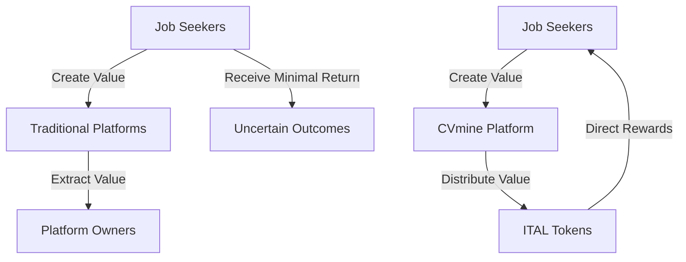

We define a job seeker's digital currency as a chain of digital signatures. Each participant transfers value to the next by digitally signing a hash of the previous transaction and the public key of the next owner and adding these to the end of the token. A recipient can verify the signatures to verify the chain of ownership.

The problem is that the recipient cannot verify that one of the owners did not double-spend the token. A common solution is to introduce a trusted central authority, or mint, that checks every transaction for double spending. After each transaction, the token must be returned to the mint to issue a new token, and only tokens issued directly from the mint are trusted not to be double-spent. The problem with this solution is that the entire monetary system depends on the company running the mint, with every transaction having to go through them.

We need a way for job seekers to be able to earn and transfer value without depending on centralized platforms that may extract disproportionate value. Our solution begins with a timestamp server but evolves into a hybrid approach that combines the efficiency of off-chain transactions with the security of blockchain technology when needed.

Our hybrid solution leverages a secure, cryptographically-verified off-chain transaction ledger as the primary system for managing token operations, with strategic synchronization to the Stellar blockchain. This approach provides an optimal balance between efficiency, cost-effectiveness, and security while maintaining the peer-to-peer nature of the system. We use a timestamp server to take a hash of a block of items to be timestamped and widely publish the hash. Each timestamp includes the previous timestamp in its hash, forming a chain, while reducing the need for constant blockchain operations.

## 2. Transactions

We define an ITAL token as a digital asset primarily managed through the CVmine transaction ledger, with optional representation on the Stellar blockchain. Transactions represent transfers of value triggered by verifiable user activity on the CVmine platform.

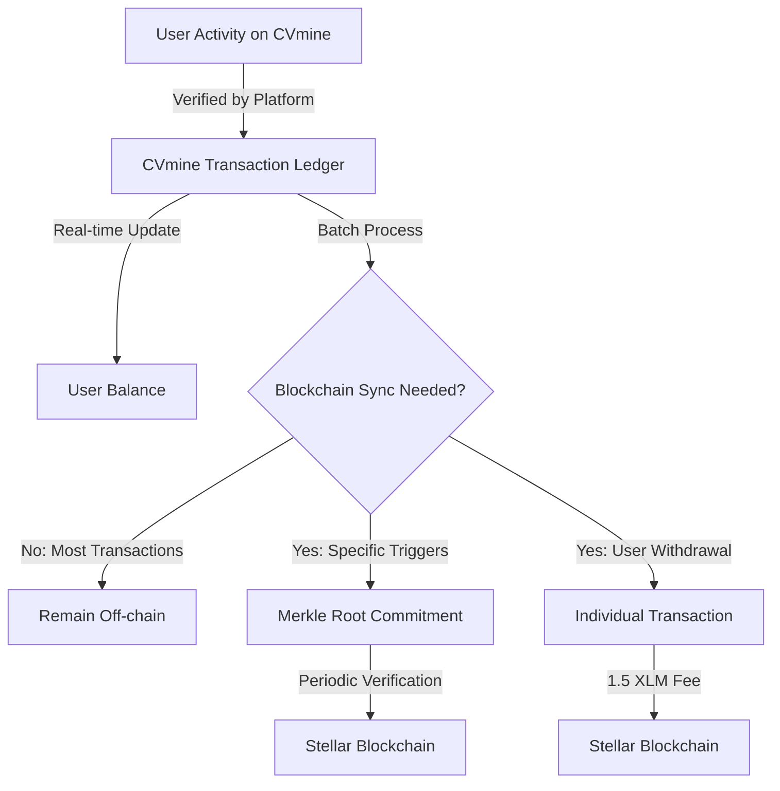

### 2.1 Off-Chain Transaction Management

The off-chain transaction management system serves as the primary mechanism for recording and managing ITAL token transactions. This approach offers significant benefits in terms of efficiency, cost, and scalability while maintaining a high level of security and integrity.

#### 2.1.1 Transaction Ledger Architecture

The CVmine Transaction Ledger is implemented as a distributed, append-only database with the following key components:

- **Distributed Architecture**: Multiple synchronized database nodes across geographically diverse locations provide redundancy and fault tolerance
- **Append-Only Structure**: Once recorded, transactions cannot be modified or deleted, creating an immutable audit trail
- **Cryptographic Verification**: Each transaction is cryptographically signed and linked to previous transactions
- **Sharded Design**: The database is horizontally partitioned to support efficient scaling as user activity increases
- **High-Availability Configuration**: Active-active replication ensures continuous operation even during node failures
- **ACID Compliance**: Transactions adhere to Atomicity, Consistency, Isolation, and Durability properties

The Transaction Ledger employs a sophisticated data model that captures all relevant aspects of token operations:

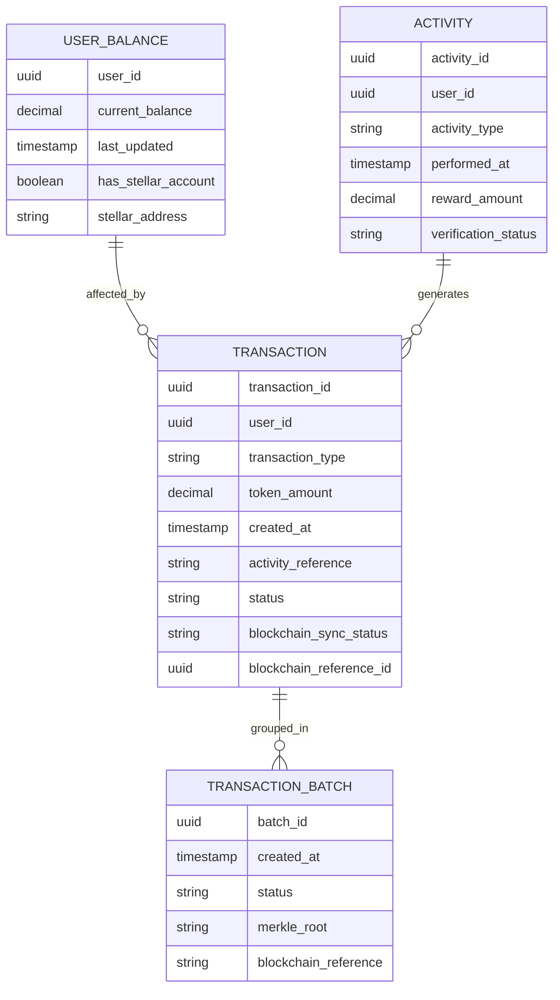

#### 2.1.2 Efficient Transaction Processing

While the Stellar blockchain provides an efficient foundation for our token economy, creating individual blockchain transactions for every platform activity would be inefficient and costly at scale. Instead, the CVmine platform implements a hybrid approach combining the CVmine transaction ledger with periodic blockchain reconciliation.

The CVmine platform maintains a secure, redundant transaction ledger system that records all user activities and associated token transfers in real-time. This approach provides several advantages:

- **Instant Feedback**: Users receive immediate confirmation of earned tokens without blockchain latency
- **Cost Efficiency**: Platform operation costs are significantly reduced by minimizing blockchain transactions
- **Scalability**: The system can handle millions of micro-activities without blockchain throughput limitations
- **Reduced Network Load**: The Stellar network remains unburdened by high-frequency small transactions

Each activity that generates tokens is recorded with comprehensive metadata including:
- The specific activity type (CV creation, application submission, etc.)
- Precise token amounts awarded
- Involved parties (recipient and source if applicable)
- Timestamps and status indicators
- Synchronization status with the blockchain

#### 2.1.3 Batch Settlement Process

The CVmine transaction ledger periodically settles accumulated transactions to the Stellar blockchain through an intelligent batching mechanism:

1. **Accumulation Phase**: User activities and associated token transfers are recorded in the secure transaction ledger
2. **Trigger Conditions**: Batch settlement occurs primarily when a user reaches 1,000 transactions, with additional triggers including:
   - Time-based triggers (e.g., weekly settlements regardless of volume)
   - Value-based triggers (e.g., when total value exceeds 100,000 ITAL)
   - Administrative triggers (e.g., end of financial reporting periods)
3. **Aggregation Logic**: Transactions are intelligently combined to optimize for:
   - Net transfers between accounts (minimizing operations)
   - Transaction fee efficiency
   - Data storage requirements
4. **Blockchain Commitment**: A single Stellar transaction containing the aggregated state changes is submitted to the blockchain
5. **Verification and Reconciliation**: The system confirms the blockchain settlement and updates the transaction synchronization status flags
6. **Ledger Maintenance**: Processed transactions are marked with their corresponding blockchain transaction identifiers

#### 2.1.4 Cryptographic Verification

To ensure the integrity of off-chain transactions without requiring full blockchain integration, the CVmine platform implements a robust cryptographic verification system:

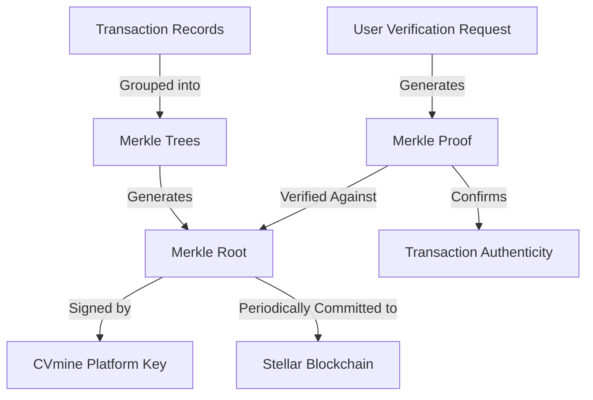

The cryptographic verification system works as follows:

1. **Merkle Tree Construction**: Transactions are assembled into Merkle trees, with each transaction forming a leaf node
2. **Hash Function**: All cryptographic operations use SHA-256 for consistent security
3. **Tree Structure**: A binary Merkle tree structure efficiently organizes transaction hashes
4. **Root Calculation**: The Merkle root is calculated by recursively hashing pairs of nodes until a single root hash remains
5. **Digital Signature**: The Merkle root is signed using CVmine's Ed25519 private key
6. **Periodic Blockchain Commitment**: The signed Merkle root is committed to the Stellar blockchain at regular intervals
7. **Proof Generation**: For any specific transaction, a Merkle proof can be generated showing its inclusion in the tree
8. **Verification Portal**: Users can verify their transactions through a dedicated verification portal

This approach provides cryptographic assurance of transaction integrity without requiring individual blockchain transactions. Users can independently verify that their activities and rewards have been properly recorded, even when transactions remain off-chain.

#### 2.1.5 Security Considerations

The hybrid approach maintains the security benefits of blockchain while improving efficiency:

- **Cryptographic Integrity**: The off-chain ledger maintains cryptographic signatures for all entries
- **Transparent Reconciliation**: Users can verify that off-chain balances match blockchain state
- **Tamper Evidence**: Any discrepancy between reported balances and blockchain state would be detectable
- **Disaster Recovery**: The blockchain serves as the authoritative record in case of system failure
- **Dispute Resolution**: The immutable blockchain record provides the basis for resolving any disputes

The CVmine transaction ledger implementation incorporates multiple security layers to maintain integrity between blockchain settlements:

- **Distributed Database Architecture**: The ledger operates across multiple geographically dispersed nodes with real-time replication
- **Multi-level Encryption**: All stored transactions use AES-256 encryption at rest and TLS 1.3 for data in transit
- **Digital Signatures**: Every transaction is signed by the platform using Ed25519 signatures, creating a verifiable audit trail
- **Immutable Append-only Structure**: Like blockchain, the off-chain ledger only allows adding new records, never modifying existing ones
- **Regular Cryptographic Attestations**: The CVmine platform publishes periodic Merkle tree roots of the off-chain ledger to the blockchain
- **Access Controls**: Fine-grained, role-based access controls restrict data access to authorized personnel
- **Intrusion Detection**: Real-time monitoring identifies and alerts on suspicious activities
- **Hardware Security Module (HSM) Integration**: Critical cryptographic operations use FIPS 140-2 Level 3 compliant HSMs

#### 2.1.6 Transaction Reconciliation

A critical component of the hybrid system is the process for reconciling off-chain transactions with the blockchain state:

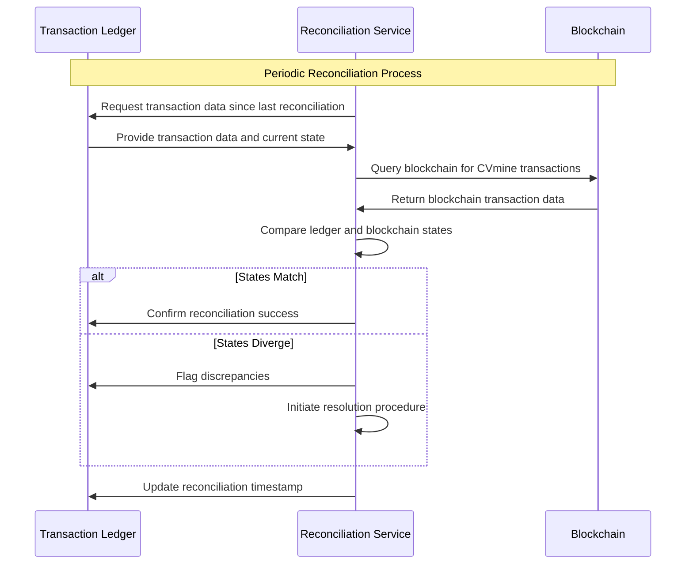

The reconciliation process ensures that when blockchain synchronization does occur, the on-chain state correctly reflects the authoritative off-chain ledger. This process includes:

1. **Scheduled Reconciliation**: Automated comparison of ledger and blockchain states at regular intervals
2. **Discrepancy Detection**: Identification of any differences between off-chain and on-chain records
3. **Resolution Procedures**: Documented processes for investigating and resolving discrepancies
4. **Audit Trail**: Comprehensive logging of all reconciliation activities and outcomes

### 2.2 Blockchain Integration Strategy

While the CVmine Transaction Ledger serves as the primary record-keeping system, strategic integration with the Stellar blockchain provides additional security, transparency, and interoperability benefits.

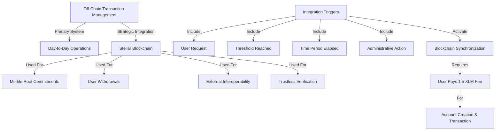

#### 2.2.1 Integration Triggers

The system synchronizes with the Stellar blockchain under specific conditions rather than for every transaction. These triggers include:

1. **User-Initiated Withdrawal**: When a user explicitly requests to withdraw tokens to an external wallet
2. **Balance Threshold**: When a user's balance exceeds a significant threshold (e.g., 10,000 ITAL)
3. **Time-Based Commitments**: Regular commitments of Merkle roots for verification purposes
4. **Administrative Triggers**: Special circumstances requiring blockchain verification
5. **External Transfer**: When tokens need to be transferred to external systems
6. **Verification Request**: When high-value operations require trustless verification

#### 2.2.2 Commitment Mechanism

When synchronization is triggered, the system employs one of two approaches:

1. **Merkle Root Commitment**: For routine verification and integrity purposes, only the Merkle root of a transaction batch is committed to the blockchain, creating an anchor point that can verify thousands of off-chain transactions with a single blockchain operation.

2. **Full Transaction Synchronization**: For withdrawals or external transfers, individual transactions are synchronized to the blockchain, creating direct on-chain representation of specific token movements.

#### 2.2.3 User Fee Structure

When users request operations that require Stellar blockchain integration, they cover the necessary network costs:

- **Account Creation Fee**: 1.5 XLM (covers the 1 XLM minimum reserve + transaction fees)
- **Transaction Fee**: Approximately 0.00001 XLM per transaction (passed through at cost)

Users have multiple options for covering these fees:
- Direct XLM payment
- Conversion of ITAL tokens to XLM at market rate
- Deduction from user rewards
- Fiat currency payment

Fees are clearly disclosed to users before they initiate blockchain operations, with educational resources explaining the necessity and benefits of blockchain integration.

### 2.3 ITAL as a Stellar Custom Asset

ITAL is implemented as a custom asset (token) on the Stellar blockchain, leveraging Stellar's robust asset infrastructure while maintaining our hybrid off-chain/on-chain approach.

#### 2.3.1 Asset Implementation Details

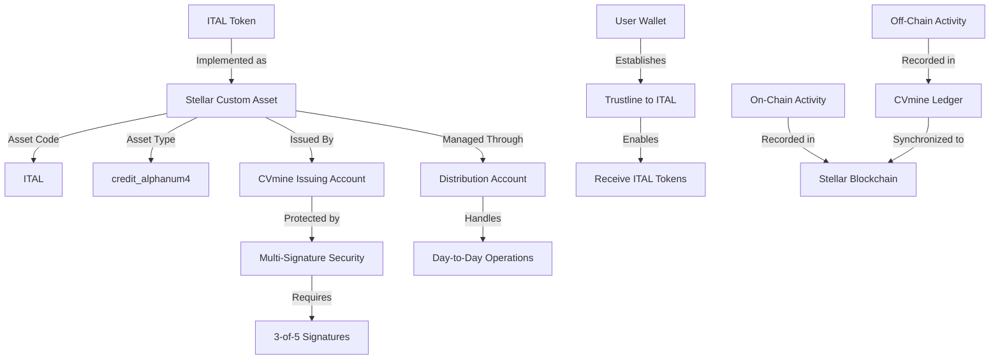

The ITAL token is technically implemented as a Stellar custom asset with the following specifications:

- **Asset Code**: ITAL
- **Asset Type**: credit_alphanum4 (4-character asset code)
- **Issuing Account**: A dedicated Stellar account controlled by CVmine with multi-signature protection
- **Home Domain**: cvmine.com
- **Toml Information**: Detailed asset information published at cvmine.com/.well-known/stellar.toml

#### 2.3.2 Asset Control and Security

The ITAL token issuing account is secured through multiple layers of protection:

- **Multi-Signature Requirements**: All issuing operations require 3-of-5 signatures from authorized key holders
- **Hardware Security**: Signing keys are stored in separate hardware security modules (HSMs)
- **Cold Storage**: The issuing account's master key is kept in cold storage with strict physical security
- **Time-Locked Transactions**: Critical operations utilize time-locked transactions for additional security
- **Distribution Account**: Day-to-day operations use a separate distribution account with lower thresholds

#### 2.3.3 Asset Configuration

The ITAL token on Stellar is configured with specific flags and settings:

- **Authorization Required**: Disabled - Any Stellar account can establish a trustline to ITAL
- **Authorization Revocable**: Enabled - Provides regulatory compliance capability if required
- **Authorization Immutable**: Disabled - Allows future configuration adjustments
- **Clawback Enabled**: Disabled - No ability to claw back tokens from user accounts

#### 2.3.4 Trustline Management

For users to receive ITAL tokens on the Stellar blockchain, they must establish a trustline to the asset:

1. **Trustline Creation**: Automatically handled when a user activates their Stellar-integrated wallet
2. **Limit Setting**: Default trustline limit set to 1 billion ITAL, adjustable by users
3. **User Education**: Clear guidance provided on the purpose and management of trustlines
4. **Trustline Costs**: The 0.5 XLM trustline reserve requirement is covered as part of the 1.5 XLM fee

#### 2.3.5 Stellar Ecosystem Integration

As a Stellar custom asset, ITAL can leverage the broader Stellar ecosystem:

- **DEX Compatibility**: ITAL can be traded on the Stellar decentralized exchange
- **Wallet Support**: Compatible with any Stellar-compatible wallet
- **Path Payments**: Supports atomic multi-asset swaps via Stellar's path payment functionality
- **Anchor Integration**: Potential for fiat on/off ramps through Stellar anchors
- **Cross-Border Capability**: Inherits Stellar's global, low-cost transfer capabilities

#### 2.3.6 Technical Integration with CVmine

The integration between the off-chain CVmine ledger and the on-chain ITAL token works as follows:

1. **Issuance Strategy**: ITAL tokens are pre-issued to the distribution account and allocated to users as needed
2. **Balance Mapping**: Each user's off-chain balance is mapped to their on-chain balance when synchronization occurs
3. **Synchronization Logic**: During blockchain synchronization, the distribution account sends the appropriate ITAL amount to user Stellar accounts
4. **Transaction Optimization**: Operations are batched to minimize Stellar transaction fees
5. **State Verification**: Regular reconciliation ensures off-chain and on-chain states remain consistent

This implementation as a Stellar custom asset provides ITAL with the security, interoperability, and transparency benefits of the Stellar network while our hybrid architecture maintains the efficiency and scalability of off-chain operations for most transactions.

### 2.4 CVmine Transaction Integration

The existing CVmine platform records all user activities in a comprehensive transaction ledger. This ledger captures essential information for each activity, including the user identifiers (both sender and recipient when applicable), token amounts, activity types, transaction status, and synchronization status with the blockchain.

The transaction ledger serves as the authoritative record for all platform-based token activities before they are committed to the blockchain. Each transaction is assigned a unique identifier and contains metadata regarding its purpose, timing, and status. Key transaction attributes include:

- **Transaction Identifier**: A unique ID for each activity that generates tokens
- **User References**: Identifiers for both the token recipient and source (when applicable)
- **Token Value**: The precise amount of ITAL tokens awarded
- **Activity Classification**: The specific type of professional development activity
- **Distribution Category**: Classification of the token distribution purpose
- **Timestamp Information**: When the activity occurred and when it was recorded
- **Status Indicators**: Current state of the transaction and synchronization status
- **Blockchain Reference**: The corresponding blockchain transaction ID if synchronized

This transaction ledger enables the CVmine platform to efficiently track all token-generating activities, maintain an accurate record of token balances, and ensure proper synchronization with the blockchain when required for verification and immutability.

### 2.5 Reward Structure

The system recognizes and rewards various professional development activities on CVmine with specific token values. Users receive **100 ITAL** for signing up as a jobseeker, and **20 ITAL** for each referral. **1 ITAL** is awarded for each CV download by employers, as well as for applying to job alerts. Jobseekers earn **50 ITAL** for designing a CV. Applications to training programs and CV downloads by training providers are each rewarded with **2 ITAL**.

## 3. Timestamp Server

For off-chain transactions, we implement a secure timestamping system using trusted timestamp authorities and cryptographic techniques. When blockchain integration occurs, we leverage the Stellar consensus protocol, which provides a secure, Byzantine fault-tolerant mechanism for transaction validation.

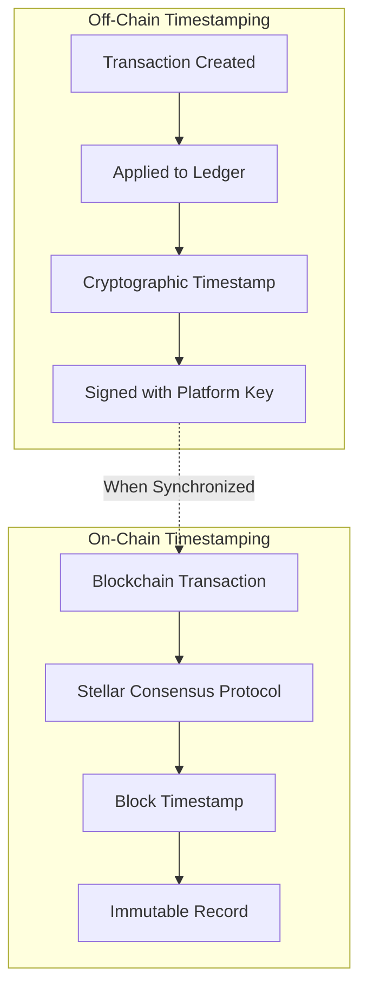

The off-chain timestamping system works as follows:

1. When a transaction is created, it receives a precise timestamp from the CVmine server
2. This timestamp is included in the transaction data and protected by the transaction's cryptographic signature
3. The timestamp's integrity is further ensured by the append-only structure of the transaction ledger
4. Periodic synchronization with the Stellar blockchain anchors these timestamps to a globally verifiable timeline

This approach ensures the temporal ordering of transactions while minimizing blockchain operation costs. The combination of secure off-chain timestamping with periodic blockchain anchoring prevents double-spending without requiring continuous blockchain integration.

## 4. Proof-of-Activity and the Stellar Consensus Protocol (SCP)

### 4.1 Overview of the Stellar Consensus Protocol

The ITAL token utilizes the Stellar Consensus Protocol (SCP) as its underlying consensus mechanism for on-chain operations. SCP is a federated Byzantine agreement system that enables fast, efficient, and secure consensus without the energy requirements of proof-of-work systems.

SCP allows each validator to choose whom they trust, creating a more flexible network structure than traditional Byzantine agreement systems. Through overlapping "quorum slices," the network can achieve consensus efficiently while remaining resilient to node failures.

### 4.2 Technical Implementation in the ITAL Ecosystem

For the ITAL token ecosystem on CVmine, SCP provides several key benefits:

- **Transaction Finality**: 3-5 seconds (compared to 10+ minutes for proof-of-work blockchains)
- **Throughput Capacity**: Approximately 1,000 transactions per second
- **Energy Efficiency**: Minimal computational requirements without mining
- **Transaction Cost**: Approximately 0.00001 XLM per transaction

The CVmine platform maintains validator nodes that participate in the Stellar network consensus process, with quorum slices configured to include other trusted validator operators. This participation ensures the network security while providing direct insight into network operations.

### 4.3 Validator Incentives and Decentralization

To support network decentralization, CVmine implements a validator incentive structure:

- **Transaction Fee Sharing**: Validators receive a portion of the transaction fees
- **Participation Rewards**: A dedicated allocation of 0.5% of total ITAL supply for validator rewards
- **Reputation System**: Validators earn reputation scores based on performance and honesty
- **Governance Voice**: Validators gain representation in protocol governance decisions

These incentives are balanced to reward honest participation without creating centralization pressures, supporting both institutional and community validators.

## 5. Network Architecture

The ITAL token system operates through a sophisticated network architecture that balances off-chain efficiency with blockchain security.

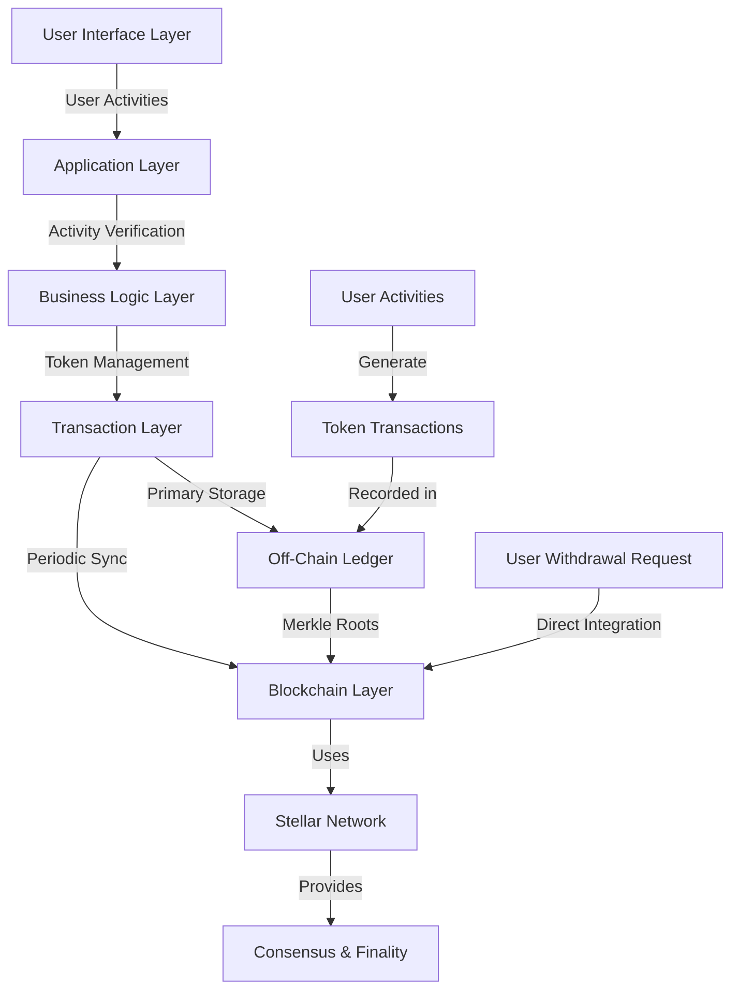

This network architecture consists of several key components:

1. **User Interface Layer**: Provides intuitive access to the CVmine platform and ITAL token functionality
2. **Application Layer**: Manages user interactions and coordinates with other system components
3. **Business Logic Layer**: Implements the rules for token generation, verification, and distribution
4. **Transaction Layer**: Processes and manages all token-related operations
5. **Off-Chain Ledger**: Serves as the primary record-keeping system for token transactions
6. **Blockchain Layer**: Provides strategic integration with the Stellar network for verification and external operations

This layered approach allows the system to operate primarily through efficient off-chain mechanisms while maintaining the option for blockchain integration when needed for security, verification, or external interoperability.

## 6. Wallet Infrastructure

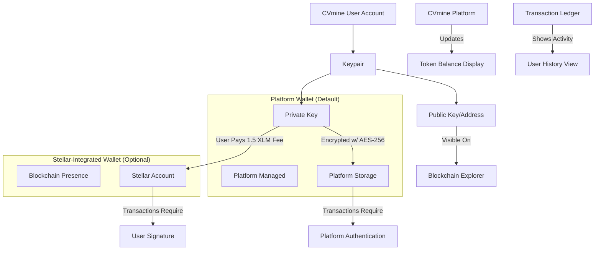

The ITAL token system implements a two-tier wallet infrastructure that balances user experience with blockchain integration options:

### 6.1 Platform Wallet (Default)

All CVmine users automatically receive a platform wallet that operates primarily off-chain. This wallet includes:

- **Balance Management**: Real-time tracking of token earnings and expenditures
- **Transaction History**: Comprehensive record of all token-related activities
- **User Interface**: Intuitive displays of balance and activity
- **Transfer Capability**: Ability to transfer tokens to other CVmine users
- **Service Payments**: Functionality to pay for premium CVmine services
- **Secure Key Storage**: Encrypted storage of the private key using **AES-256** at the application level

The platform wallet requires no blockchain integration or fees, allowing for immediate setup and a streamlined user experience. All transactions within this wallet are managed through the CVmine Transaction Ledger with cryptographic verification.

### 6.2 Stellar-Integrated Wallet (Optional)

Users can optionally upgrade to a Stellar-integrated wallet that provides additional capabilities:

- **Blockchain Presence**: Token holdings represented on the Stellar blockchain
- **External Transfers**: Ability to send tokens to external Stellar addresses
- **Third-Party Integration**: Compatibility with Stellar-based services and exchanges
- **Trustless Verification**: Independent verification without relying on CVmine

Upgrading to a Stellar-integrated wallet requires:

1. User's explicit request for blockchain integration
2. Payment of the 1.5 XLM fee (covering the 1 XLM minimum reserve + transaction fees)
3. Completion of any required verification procedures
4. Establishment of a trustline to the ITAL asset

### 6.3 Wallet Migration Strategy

The CVmine platform implements a phased approach to wallet migration:

1. **Education Phase**: Comprehensive user education about wallet security and key management
2. **Opt-in Beta**: Limited release to technically proficient users
3. **Hybrid Period**: Both wallet types available, with gradual feature parity
4. **Guided Migration**: Assisted transition process for interested users
5. **Legacy Support**: Continued support for platform wallets

The migration process preserves user assets and identity through secure key generation, multi-signature transitions, and verifiable recovery options.

## 7. Token Value Mechanisms

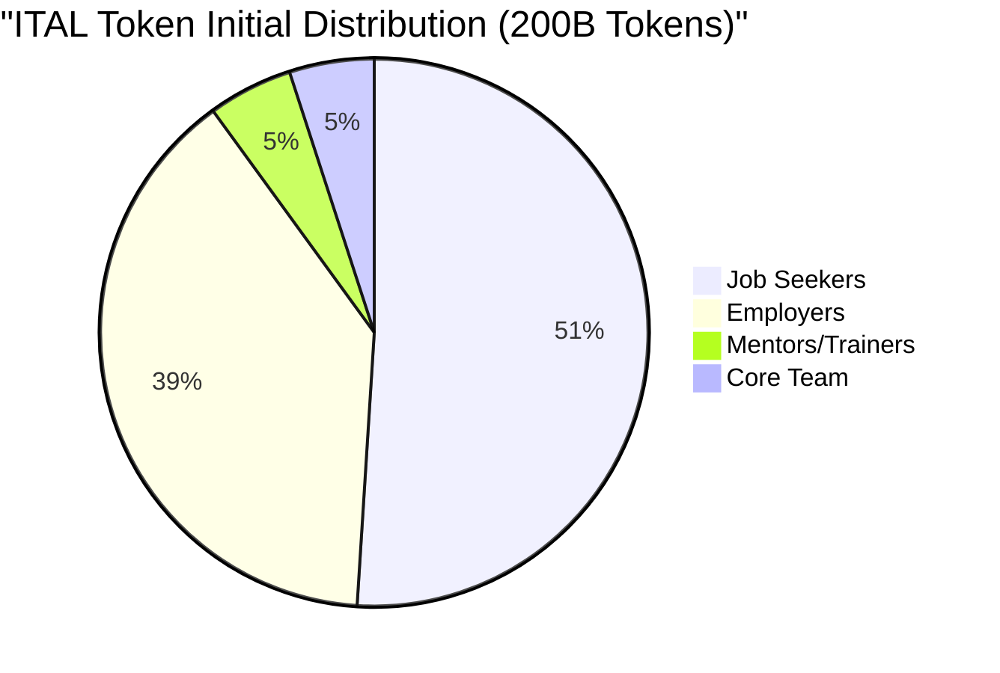

The ITAL token employs a fixed distribution model with an initial mint of 200 billion tokens allocated as follows: 51% to job seekers, 39% to employers, 5% to mentors and trainers, and 5% to the core development team. The total token supply is capped at 6 trillion ITAL, with a precision of up to seven decimal places. Tokens are generated solely through user activity on the CVmine platform, ensuring a direct correlation between value creation and value distribution. 

The token holds utility in various ways on the CVmine platform—users can spend ITAL for premium certification programs, enhanced job profile features, access to training resources, and membership tiers that unlock additional benefits based on their holdings. To enforce scarcity and maintain long-term value, the system incorporates several mechanisms: token generation is exclusively tied to verifiable human effort, 2% of tokens used for premium services are burned to reduce supply, and users are rewarded for maintaining minimum token balances. Furthermore, ITAL's value stability is maintained through a reserve fund holding 5% of the initially minted tokens, a buy-back program funded by CVmine platform revenue to stabilize market fluctuations, and staking rewards offering an annual yield to users who lock their tokens for set periods.

### 7.1 CVmine Reward Structure

The CVmine platform implements a comprehensive reward structure that tokenizes value creation across all aspects of the job search process:

```mermaid
graph TD
    A[CVmine Activity Categories] --> B[Profile Creation]
    A --> C[Platform Engagement]
    A --> D[Job Application]
    A --> E[Learning & Development]
    A --> F[Network Building]
    
    B --> G[Complete Profile: 100 ITAL]
    B --> H[CV Design: 50 ITAL]
    B --> I[Skill Assessment: 25 ITAL]
    
    C --> J[Daily Login: 5 ITAL]
    C --> K[Content Sharing: 10 ITAL]
    C --> L[Forum Participation: 15 ITAL]
    
    D --> M[Job Application: 1 ITAL]
    D --> N[Interview Completion: 20 ITAL]
    D --> O[Feedback Submission: 5 ITAL]
    
    E --> P[Course Completion: 30 ITAL]
    E --> Q[Certification: 50 ITAL]
    E --> R[Skill Endorsement: 5 ITAL]
    
    F --> S[New Referral: 20 ITAL]
    F --> T[Mentor Connection: 15 ITAL]
    F --> U[Community Contribution: 25 ITAL]
```

Each activity on the CVmine platform generates a specific ITAL token reward, creating a comprehensive incentive system that rewards all forms of positive engagement. The reward structure is designed to recognize both small, frequent activities and significant milestone achievements, ensuring users are continuously motivated to engage with the platform in meaningful ways.

The transaction ledger maintained by CVmine provides detailed records of all token-generating activities, including the specific activity category, token amount, and transaction status. This detailed tracking enables precise accounting of token distribution while providing valuable analytics regarding user engagement patterns.

## 8. Privacy

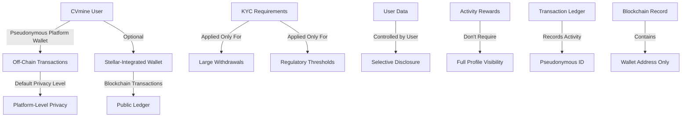

The ITAL token system on CVmine prioritizes user privacy by adopting a more secure and user-centric approach compared to traditional job-seeking systems. Instead of exposing sensitive personal information, the CVmine platform allows users to interact through pseudonymous identifiers. This ensures that individuals can earn rewards and participate in the ecosystem without fully revealing their identity or personal data. Users have complete control over what information they choose to share, and rewards for platform activity do not require full profile visibility. 

The CVmine transaction ledger maintains privacy by associating activities with pseudonymous identifiers rather than directly linking to personally identifiable information. When transactions are settled to the blockchain, only the wallet addresses and token amounts are recorded, maintaining user privacy at the blockchain level.

For enhanced privacy on the blockchain, the system also supports:

- **Transaction Mixing**: Optional mixing services for blockchain withdrawals
- **Zero-Knowledge Proofs**: Selective implementation for privacy-sensitive operations
- **Confidential Assets**: Research into Stellar-compatible confidential transaction options

Despite this commitment to privacy, the CVmine platform maintains regulatory compliance by implementing Know Your Customer (KYC) procedures specifically for token withdrawals above regulatory thresholds, ensuring both security and adherence to legal standards.

## 9. Economic Sustainability Model

To maintain the economic stability of the ITAL token ecosystem, a sophisticated mathematical model is used to balance token distribution with service usage:

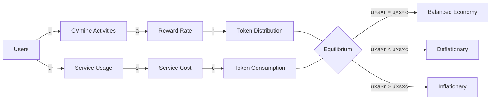

The base equilibrium formula is:

u × a × r = u × s × c

Where:
- u = number of users
- a = average number of activities performed
- r = reward rate
- s = service utilization rate
- c = average cost of services

This formula ensures that the rate at which tokens are distributed through user activity on CVmine is matched by the rate at which tokens are used within the platform.

### 9.1 Advanced Economic Modeling

Beyond the basic equilibrium formula, the CVmine platform implements more sophisticated economic modeling:

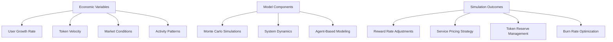

The advanced economic model incorporates:

1. **User Growth Scenarios**: Projections based on different platform adoption rates
2. **Token Velocity Analysis**: Measurement of token circulation speed and its impact on value
3. **External Market Factors**: Consideration of broader cryptocurrency market conditions
4. **System Dynamics Modeling**: Simulation of feedback loops in the token economy
5. **Sensitivity Analysis**: Testing of key parameters to identify stability factors

This comprehensive modeling approach allows the CVmine platform to make data-driven adjustments to reward rates, service costs, and token mechanisms in response to changing conditions, ensuring long-term economic sustainability.

### 9.2 Stabilization Mechanisms

To maintain value stability, the ITAL token implements several complementary mechanisms:

- **Dynamic Reward Adjustment**: Algorithmic adjustment of activity rewards based on economic conditions
- **Graduated Service Pricing**: Tiered pricing for premium services that scales with token valuation
- **Buyback Reserve**: Strategic reserve for market operations during high volatility
- **Token Burning**: Permanent removal of tokens from circulation based on service usage
- **Staking Incentives**: Rewards for long-term holders that reduce circulation velocity
- **User Growth Incentives**: Campaigns that align marketing efforts with tokenomic stability

These mechanisms work together to maintain equilibrium in the ITAL token economy across various market conditions and user growth scenarios.

## 10. Technical Implementation

### 10.1 Off-Chain Ledger Implementation

The off-chain transaction ledger is implemented using a sophisticated stack of technologies designed for security, performance, and reliability:

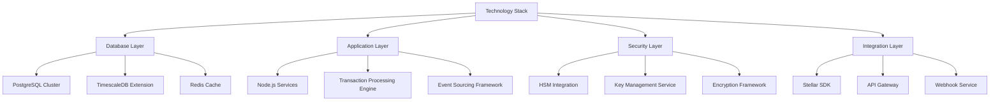

#### 10.1.1 Database Implementation

The transaction ledger's database layer leverages:

- **PostgreSQL**: Enterprise-grade relational database for reliable transaction management
- **TimescaleDB**: Extension for efficient time-series data handling
- **Partitioning**: Horizontal partitioning by date and user ID for performance
- **Indexing Strategy**: Optimized indexes for frequent query patterns
- **Replication**: Synchronous multi-node replication for redundancy
- **Point-in-Time Recovery**: Continuous archiving of write-ahead logs
- **Redis Cache**: In-memory caching for frequently accessed data

#### 10.1.2 Application Services

The application layer managing the ledger consists of:

- **Microservice Architecture**: Discrete services for transaction processing, user management, verification, and synchronization
- **Event Sourcing**: Recording all changes as a series of immutable events
- **CQRS Pattern**: Separation of command and query responsibilities
- **Idempotent Processing**: Safe handling of duplicate requests
- **Circuit Breakers**: Graceful handling of dependency failures
- **Horizontal Scaling**: Ability to add processing nodes as demand increases
- **Zero-Downtime Deployment**: Continuous operation during updates

#### 10.1.3 Security Implementation

The security layer incorporates:

- **Hardware Security Modules (HSMs)**: FIPS 140-2 Level 3 certified devices for cryptographic operations
- **Key Rotation**: Regular rotation of encryption and signing keys
- **Multi-Layer Encryption**: Data encrypted at rest and in transit
- **Access Control**: Fine-grained permissions with least privilege principle
- **Audit Logging**: Tamper-evident logging of all administrative actions
- **Intrusion Detection**: Real-time monitoring for suspicious activities
- **Threat Modeling**: Continuous assessment of potential attack vectors

#### 10.1.4 Blockchain Integration Implementation

The integration with Stellar is managed through:

- **Stellar SDK**: Official libraries for blockchain interaction
- **Transaction Construction**: Formation of valid Stellar transactions
- **Multi-Signature Support**: Implementation of threshold signatures
- **Horizon API Integration**: Interface with Stellar's public API
- **Testnet Environment**: Testing infrastructure before mainnet deployment
- **Fallback Mechanisms**: Handling of network disruptions
- **Fee Management**: Dynamic adjustment to network conditions

### 10.2 Scaling Strategy

The system is designed to scale efficiently with growing user activity through:

- **Horizontal Scaling**: Adding processing nodes as demand increases
- **Vertical Scaling**: Expanding resources for existing components
- **Data Partitioning**: Sharding data based on time and user segments
- **Load Distribution**: Geographic distribution of processing
- **Performance Benchmarks**:
  - Off-chain transactions: 10,000+ transactions per second
  - On-chain synchronization: 1,000 transactions per second
  - User response latency: <100ms for standard operations

This scaling strategy enables the platform to efficiently handle millions of users and billions of transactions while maintaining performance and reliability.

### 10.3 Disaster Recovery and Business Continuity

The platform implements comprehensive disaster recovery procedures:

- **Real-time Replication**: Continuous synchronization across multiple data centers
- **Point-in-Time Backups**: Regular snapshots with off-site storage
- **Geographic Distribution**: Infrastructure spread across multiple regions
- **Automated Recovery**: Self-healing systems with minimal manual intervention
- **Regular Testing**: Scheduled disaster recovery drills and simulations

These measures ensure system resilience with a recovery time objective (RTO) of less than 4 hours and a recovery point objective (RPO) of less than 5 minutes, even in catastrophic failure scenarios.

### 10.4 Smart Contract Capabilities

While Stellar does not support Turing-complete smart contracts like Ethereum, the ITAL token leverages Stellar's transaction capabilities for programmable functionality:

- **Escrow Arrangements**: Time-locked transactions for conditional payments
- **Atomic Swaps**: Cross-asset exchanges with built-in transaction guarantees
- **Multi-Signature Operations**: Threshold requirements for high-value transactions
- **Stream Payments**: Structured series of payments for ongoing rewards
- **Path Payments**: Automatic multi-hop exchanges for liquidity
- **Clawback Operations**: Limited recoverability for regulatory compliance

These capabilities enable programmatic token behaviors while maintaining the efficiency and security benefits of the Stellar platform.

## 11. Conclusion

In conclusion, we have introduced a decentralized incentive-based system integrated with the CVmine platform, designed to support professional development and job-seeking efforts without depending on the goodwill or control of a centralized authority. By utilizing the ITAL token within a hybrid off-chain/on-chain architecture, users are directly rewarded for meaningful activities such as learning, upskilling, and applying for jobs on CVmine.

Our implementation of ITAL as a Stellar custom asset provides the security, transparency, and interoperability benefits of an established blockchain while our hybrid approach maintains the efficiency and scalability needed for a reward-based platform. By managing most transactions off-chain with cryptographic verification and selective on-chain synchronization, we've created a system that balances cost-effectiveness with security.

The integration of ITAL tokens with the CVmine platform creates a virtuous cycle where user activities generate tangible rewards, which in turn incentivize further engagement. The comprehensive transaction ledger provides the technical foundation for this integration, enabling immediate token rewards while leveraging the security and transparency of the Stellar blockchain at strategic points.

By charging users only when they specifically request blockchain integration, the system ensures that costs are fairly allocated while maintaining accessibility for all participants. This approach maximizes efficiency while providing each user with the level of blockchain integration that suits their specific needs.

Through our economic modeling and stability mechanisms, we've designed the ITAL token ecosystem for long-term sustainability, creating value alignment between job seekers, employers, and the platform itself. As the ecosystem grows, our technical infrastructure will scale efficiently while maintaining the security, performance, and user experience that are essential for widespread adoption.

The ITAL token transforms the traditional job search process into a value-generating activity for all participants, creating a more equitable and efficient professional development ecosystem on the CVmine platform.
