# ITAL Token: A Peer-to-Peer Incentive System with Hybrid Off-Chain/On-Chain Architecture for Professional Development on CVmine

## Abstract

We propose a peer-to-peer incentive system for professional development activities integrated with the CVmine job platform. The system enables participants to earn ITAL tokens for job-seeking and career advancement efforts without relying on the goodwill of platforms or employers. ITAL tokens are generated and distributed through active participation in CVmine activities, with transactions primarily managed off-chain through a secure transaction ledger for efficiency and cost reduction. Strategic synchronization with the Stellar blockchain occurs only when necessary, with users covering the minimal Stellar network fees for on-chain operations. This approach maximizes efficiency and scalability while maintaining cryptographic verification and optional blockchain integration. We define rules that incentivize participation while preventing manipulation of the reward mechanism. The result is a decentralized network of job seekers and professionals that creates and exchanges value through meaningful engagement on the CVmine platform, with the flexibility to operate primarily off-chain while leveraging blockchain security when needed.

## 1. Introduction

Traditional job search platforms operate on a model where users provide substantial value through data, content creation, and engagement while receiving little proportional reward. Even as digital job marketplaces have grown, the fundamental incentive structures remain tilted away from job seekers, who invest significant time and effort with uncertain returns.

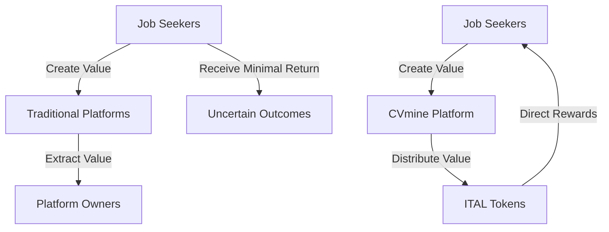

We define a job seeker's digital currency as a chain of digital signatures. Each participant transfers value to the next by digitally signing a hash of the previous transaction and the public key of the next owner and adding these to the end of the token. A recipient can verify the signatures to verify the chain of ownership.

The problem is that the recipient cannot verify that one of the owners did not double-spend the token. A common solution is to introduce a trusted central authority, or mint, that checks every transaction for double spending. After each transaction, the token must be returned to the mint to issue a new token, and only tokens issued directly from the mint are trusted not to be double-spent. The problem with this solution is that the entire monetary system depends on the company running the mint, with every transaction having to go through them.

We need a way for job seekers to be able to earn and transfer value without depending on centralized platforms that may extract disproportionate value. Our solution begins with a timestamp server but evolves into a hybrid approach that combines the efficiency of off-chain transactions with the security of blockchain technology when needed.

Our hybrid solution leverages a secure, cryptographically-verified off-chain transaction ledger as the primary system for managing token operations, with strategic synchronization to the Stellar blockchain. This approach provides an optimal balance between efficiency, cost-effectiveness, and security while maintaining the peer-to-peer nature of the system. We use a timestamp server to take a hash of a block of items to be timestamped and widely publish the hash. Each timestamp includes the previous timestamp in its hash, forming a chain, while reducing the need for constant blockchain operations.

## 2. Transactions

We define an ITAL token as a digital asset primarily managed through the CVmine transaction ledger, with optional representation on the Stellar blockchain. Transactions represent transfers of value triggered by verifiable user activity on the CVmine platform.

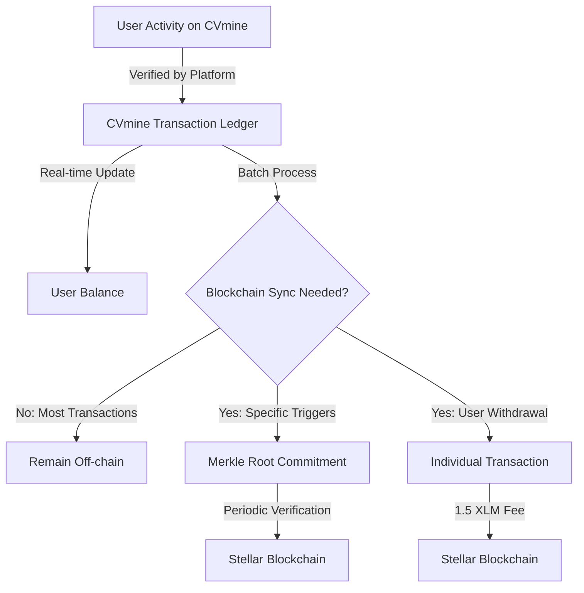

### 2.1 Off-Chain Transaction Management

The off-chain transaction management system serves as the primary mechanism for recording and managing ITAL token transactions. This approach offers significant benefits in terms of efficiency, cost, and scalability while maintaining a high level of security and integrity.

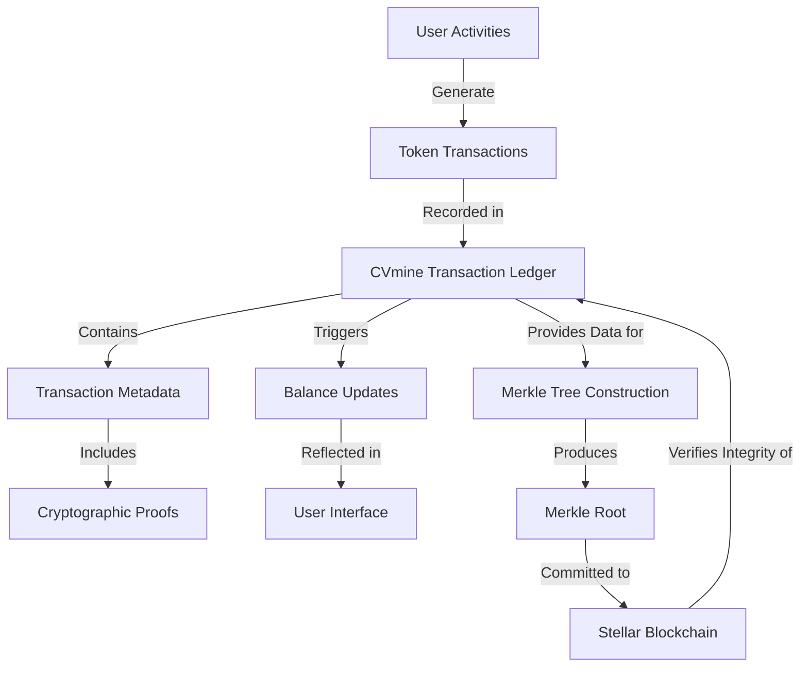

#### 2.1.1 Transaction Ledger Architecture

The CVmine Transaction Ledger is implemented as a distributed, append-only database with the following key components:

- **Distributed Architecture**: Multiple synchronized database nodes across geographically diverse locations provide redundancy and fault tolerance
- **Append-Only Structure**: Once recorded, transactions cannot be modified or deleted, creating an immutable audit trail
- **Cryptographic Verification**: Each transaction is cryptographically signed and linked to previous transactions
- **Sharded Design**: The database is horizontally partitioned to support efficient scaling as user activity increases
- **High-Availability Configuration**: Active-active replication ensures continuous operation even during node failures
- **ACID Compliance**: Transactions adhere to Atomicity, Consistency, Isolation, and Durability properties

#### 2.1.1.1 Efficient Transaction Processing

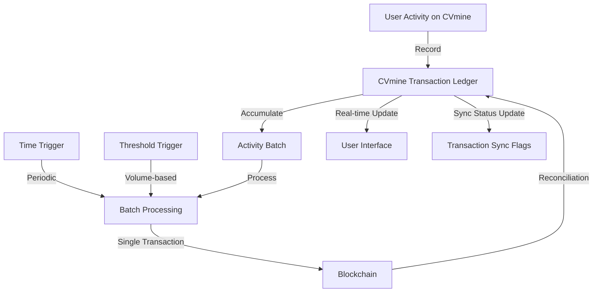

While the Stellar blockchain provides an efficient foundation for our token economy, creating individual blockchain transactions for every platform activity would be inefficient and costly at scale. Instead, the CVmine platform implements a hybrid approach combining the CVmine transaction ledger with periodic blockchain reconciliation.

#### 2.1.1.2 CVmine Transaction Ledger as Off-chain Pool

The CVmine platform maintains a secure, redundant transaction ledger system that records all user activities and associated token transfers in real-time. This approach provides several advantages:

- **Instant Feedback**: Users receive immediate confirmation of earned tokens without blockchain latency
- **Cost Efficiency**: Platform operation costs are significantly reduced by minimizing blockchain transactions
- **Scalability**: The system can handle millions of micro-activities without blockchain throughput limitations
- **Reduced Network Load**: The Stellar network remains unburdened by high-frequency small transactions

Each activity that generates tokens is recorded with comprehensive metadata including:
- The specific activity type (CV creation, application submission, etc.)
- Precise token amounts awarded
- Involved parties (recipient and source if applicable)
- Timestamps and status indicators
- Synchronization status with the blockchain

#### 2.1.1.3 Batch Settlement Process

The CVmine transaction ledger periodically settles accumulated transactions to the Stellar blockchain through an intelligent batching mechanism:

1. **Accumulation Phase**: User activities and associated token transfers are recorded in the secure transaction ledger
2. **Trigger Conditions**: Batch settlement occurs primarily when a user reaches 1,000 transactions, with additional triggers including:
   - Time-based triggers (e.g., weekly settlements regardless of volume)
   - Value-based triggers (e.g., when total value exceeds 100,000 ITAL)
   - Administrative triggers (e.g., end of financial reporting periods)
3. **Aggregation Logic**: Transactions are intelligently combined to optimize for:
   - Net transfers between accounts (minimizing operations)
   - Transaction fee efficiency
   - Data storage requirements
4. **Blockchain Commitment**: A single Stellar transaction containing the aggregated state changes is submitted to the blockchain
5. **Verification and Reconciliation**: The system confirms the blockchain settlement and updates the transaction synchronization status flags
6. **Ledger Maintenance**: Processed transactions are marked with their corresponding blockchain transaction identifiers

#### 2.1.1.4 Settlement Timing Strategy

The CVmine platform's primary settlement strategy revolves around per-user transaction thresholds:

- **Per-User Batching**: Each user's transactions are tracked independently, with settlement occurring upon reaching 1,000 activities
- **Variable Frequency**: High-activity users experience more frequent settlements than occasional users
- **Randomized Offset**: Small random variations in the exact settlement threshold (±5%) prevent timing-based exploitation
- **Activity Categorization**: Different weights are assigned to various activities when counting toward the threshold
- **Intelligent Grouping**: Users with interrelated transactions are batched together when possible to maximize efficiency
- **Optimized Settlement Windows**: Settlements are scheduled during periods of low Stellar network congestion
- **Interleaved Processing**: Multiple user batches are processed in parallel to prevent bottlenecks

This user-centric approach to settlement timing balances efficiency, security, and user experience while preventing exploitation of predictable settlement cycles. By focusing on per-user transaction counts rather than fixed time periods, the system naturally adapts to varying levels of platform activity.

The Transaction Ledger employs a sophisticated data model that captures all relevant aspects of token operations:

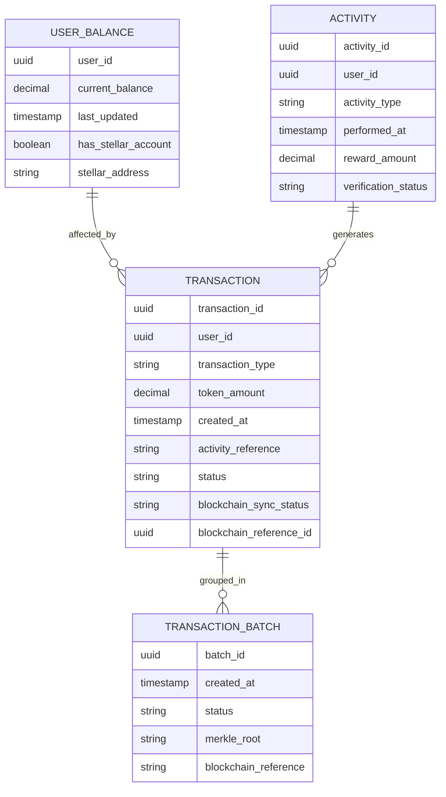

Each transaction in the ledger undergoes a well-defined lifecycle:

1. **Creation**: A new transaction record is generated when a user completes a reward-eligible activity
2. **Verification**: The transaction is validated for compliance with platform rules and anti-fraud measures
3. **Commitment**: Once verified, the transaction is committed to the transaction ledger
4. **Balance Update**: The user's token balance is immediately updated to reflect the new transaction
5. **Batch Assignment**: Periodically, transactions are assigned to batches for potential blockchain synchronization
6. **Merkle Tree Inclusion**: Transactions are included in Merkle trees for cryptographic verification
7. **Optional Blockchain Synchronization**: Under specific conditions, transaction batches may be synchronized to the Stellar blockchain

#### 2.1.2 Cryptographic Verification

To ensure the integrity of off-chain transactions without requiring full blockchain integration, the CVmine platform implements a robust cryptographic verification system:

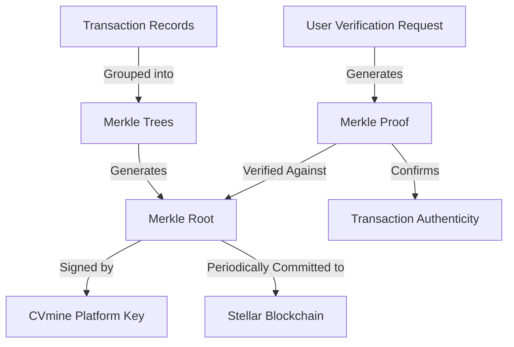

The cryptographic verification system works as follows:

1. **Merkle Tree Construction**: Transactions are assembled into Merkle trees, with each transaction forming a leaf node
2. **Hash Function**: All cryptographic operations use SHA-256 for consistent security
3. **Tree Structure**: A binary Merkle tree structure efficiently organizes transaction hashes
4. **Root Calculation**: The Merkle root is calculated by recursively hashing pairs of nodes until a single root hash remains
5. **Digital Signature**: The Merkle root is signed using CVmine's Ed25519 private key
6. **Periodic Blockchain Commitment**: The signed Merkle root is committed to the Stellar blockchain at regular intervals
7. **Proof Generation**: For any specific transaction, a Merkle proof can be generated showing its inclusion in the tree
8. **Verification Portal**: Users can verify their transactions through a dedicated verification portal

This approach provides cryptographic assurance of transaction integrity without requiring individual blockchain transactions. Users can independently verify that their activities and rewards have been properly recorded, even when transactions remain off-chain.

#### 2.1.3 Security Considerations

This hybrid approach maintains the security benefits of blockchain while improving efficiency:

- **Cryptographic Integrity**: The off-chain ledger maintains cryptographic signatures for all entries
- **Transparent Reconciliation**: Users can verify that off-chain balances match blockchain state
- **Tamper Evidence**: Any discrepancy between reported balances and blockchain state would be detectable
- **Disaster Recovery**: The blockchain serves as the authoritative record in case of system failure
- **Dispute Resolution**: The immutable blockchain record provides the basis for resolving any disputes

##### 2.1.3.1 Off-chain Ledger Security

The CVmine transaction ledger implementation incorporates multiple security layers to maintain integrity between blockchain settlements:

- **Distributed Database Architecture**: The ledger operates across multiple geographically dispersed nodes with real-time replication
- **Multi-level Encryption**: All stored transactions use AES-256 encryption at rest and TLS 1.3 for data in transit
- **Digital Signatures**: Every transaction is signed by the platform using Ed25519 signatures, creating a verifiable audit trail
- **Immutable Append-only Structure**: Like blockchain, the off-chain ledger only allows adding new records, never modifying existing ones
- **Regular Cryptographic Attestations**: The CVmine platform publishes periodic Merkle tree roots of the off-chain ledger to the blockchain
- **Comprehensive Audit Logging**: All administrative actions are logged with tamper-evident mechanisms
- **Hardware Security Module (HSM) Integration**: Critical cryptographic operations use FIPS 140-2 Level 3 compliant HSMs
- **Access Controls**: Fine-grained, role-based access controls restrict data access to authorized personnel
- **Intrusion Detection**: Real-time monitoring identifies and alerts on suspicious activities
- **Automated Backups**: Regular encrypted backups to geographically distributed locations
- **Penetration Testing**: Regular third-party security assessments
- **Bug Bounty Program**: Incentives for responsible disclosure of security vulnerabilities

To protect against specific attack vectors related to token systems, additional measures include:

- **Rate Limiting**: Prevention of high-frequency transaction spam
- **Fraud Detection**: Machine learning algorithms identify suspicious patterns
- **IP Monitoring**: Tracking of anomalous access patterns
- **Behavioral Analysis**: Identification of user behavior that deviates from established patterns
- **Multi-Factor Authentication**: Required for administrative functions and high-value operations

##### 2.1.3.2 Trust Considerations

The hybrid architecture requires a carefully balanced trust model:

- **Bounded Trust Window**: Users need only trust the CVmine platform between settlement periods, not indefinitely
- **Verifiable Pending Transactions**: All off-chain transactions provide cryptographic receipts that users can independently verify
- **Transparency Portal**: A real-time dashboard shows the current state of the off-chain ledger and pending settlements
- **Forced Settlement Option**: High-value users can trigger immediate settlement of their transactions for a small fee
- **Trust Minimization**: The architecture is designed to minimize, not eliminate, required trust through verifiable processes
- **Regulatory Oversight**: Regular third-party audits verify the integrity of the off-chain ledger systems

##### 2.1.3.3 Dispute Resolution

The CVmine platform implements a structured dispute resolution process:

1. **Automated Verification**: Initial disputes trigger automatic verification against cryptographic receipts
2. **Evidence Collection**: The system preserves transaction records, communications, and audit logs related to the dispute
3. **Tiered Resolution Process**:
   - Level 1: Automated reconciliation through the CVmine platform
   - Level 2: Review by CVmine support personnel
   - Level 3: Assessment by independent third-party arbitrators
4. **Smart Contract Arbitration**: Critical disputes can leverage Stellar's multisignature capabilities for trustless resolution
5. **Time-Bounded Process**: All disputes follow strict timelines to ensure prompt resolution
6. **Blockchain Evidence**: The immutable nature of settled transactions provides definitive evidence for dispute resolution

##### 2.1.3.4 Advanced Recovery Procedures

In the event of a major system failure or compromise, the CVmine platform implements these recovery procedures:

1. **Immediate Suspension**: Upon detection of anomalies, the system temporarily suspends new off-chain transactions
2. **State Verification**: All user balances are verified against the last blockchain settlement and cryptographic receipts
3. **Differential Analysis**: The system performs a comprehensive comparison between the off-chain ledger and verified records
4. **Secure Reconstruction**: If necessary, the off-chain ledger is reconstructed from the last valid state using backup systems
5. **Progressive Reactivation**: The system resumes operations in phases, prioritizing verification over new transactions
6. **Transparent Communication**: Throughout the recovery process, users receive clear updates on the status and impact
7. **Post-Incident Analysis**: After resolution, a detailed report identifies root causes and implements preventative measures

#### 2.1.4 Transaction Reconciliation

A critical component of the hybrid system is the process for reconciling off-chain transactions with the blockchain state:

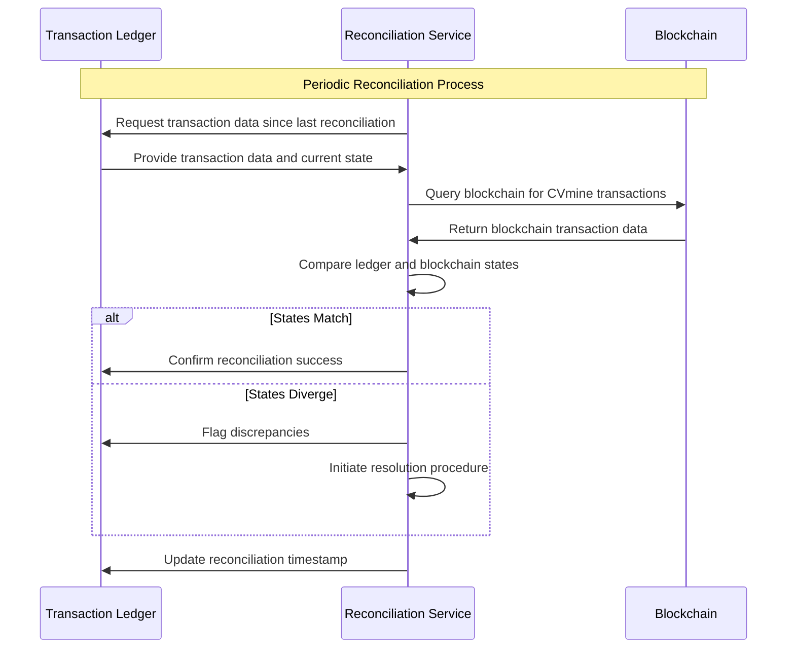

The reconciliation process ensures that when blockchain synchronization does occur, the on-chain state correctly reflects the authoritative off-chain ledger. This process includes:

1. **Scheduled Reconciliation**: Automated comparison of ledger and blockchain states at regular intervals
2. **Discrepancy Detection**: Identification of any differences between off-chain and on-chain records
3. **Resolution Procedures**: Documented processes for investigating and resolving discrepancies
4. **Audit Trail**: Comprehensive logging of all reconciliation activities and outcomes

This reconciliation process maintains the integrity of the hybrid system by ensuring that on-chain commitments accurately reflect the off-chain state when synchronization occurs.

### 2.2 Blockchain Integration Strategy

While the CVmine Transaction Ledger serves as the primary record-keeping system, strategic integration with the Stellar blockchain provides additional security, transparency, and interoperability benefits.

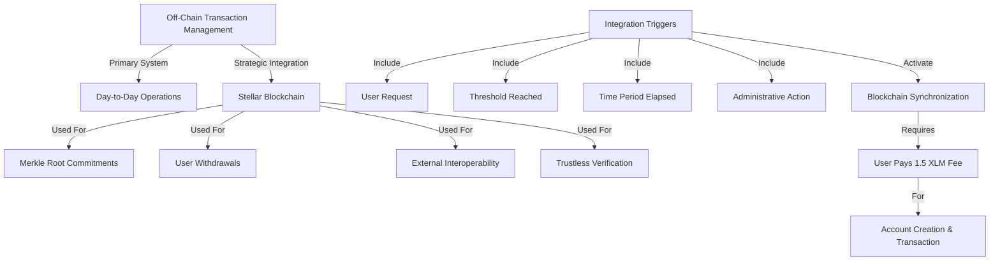

#### 2.2.1 Integration Triggers

The system synchronizes with the Stellar blockchain under specific conditions rather than for every transaction. These triggers include:

1. **User-Initiated Withdrawal**: When a user explicitly requests to withdraw tokens to an external wallet
2. **Balance Threshold**: When a user's balance exceeds a significant threshold (e.g., 10,000 ITAL)
3. **Time-Based Commitments**: Regular commitments of Merkle roots for verification purposes
4. **Administrative Triggers**: Special circumstances requiring blockchain verification
5. **External Transfer**: When tokens need to be transferred to external systems
6. **Verification Request**: When high-value operations require trustless verification

#### 2.2.2 Commitment Mechanism

When synchronization is triggered, the system employs one of two approaches:

1. **Merkle Root Commitment**: For routine verification and integrity purposes, only the Merkle root of a transaction batch is committed to the blockchain, creating an anchor point that can verify thousands of off-chain transactions with a single blockchain operation.

2. **Full Transaction Synchronization**: For withdrawals or external transfers, individual transactions are synchronized to the blockchain, creating direct on-chain representation of specific token movements.

#### 2.2.3 User Fee Structure

When users request operations that require Stellar blockchain integration, they cover the necessary network costs:

- **Account Creation Fee**: 1.5 XLM (covers the 1 XLM minimum reserve + transaction fees)
- **Transaction Fee**: Approximately 0.00001 XLM per transaction (passed through at cost)

Users have multiple options for covering these fees:
- Direct XLM payment
- Conversion of ITAL tokens to XLM at market rate
- Deduction from user rewards
- Fiat currency payment

Fees are clearly disclosed to users before they initiate blockchain operations, with educational resources explaining the necessity and benefits of blockchain integration.

### 2.3 CVmine Transaction Integration

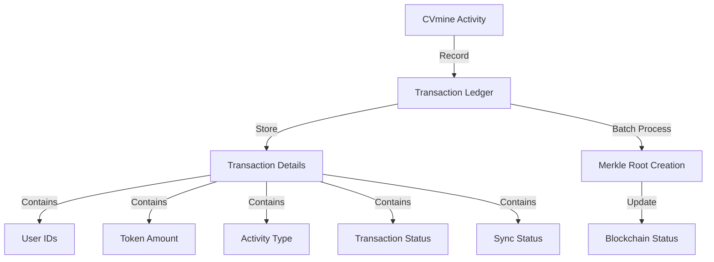

The existing CVmine platform records all user activities in a comprehensive transaction ledger. This ledger captures essential information for each activity, including the user identifiers (both sender and recipient when applicable), token amounts, activity types, transaction status, and synchronization status with the blockchain.

The transaction ledger serves as the authoritative record for all platform-based token activities before they are committed to the blockchain. Each transaction is assigned a unique identifier and contains metadata regarding its purpose, timing, and status. Key transaction attributes include:

- **Transaction Identifier**: A unique ID for each activity that generates tokens
- **User References**: Identifiers for both the token recipient and source (when applicable)
- **Token Value**: The precise amount of ITAL tokens awarded
- **Activity Classification**: The specific type of professional development activity
- **Distribution Category**: Classification of the token distribution purpose
- **Timestamp Information**: When the activity occurred and when it was recorded
- **Status Indicators**: Current state of the transaction and synchronization status
- **Blockchain Reference**: The corresponding blockchain transaction ID if synchronized

This transaction ledger enables the CVmine platform to efficiently track all token-generating activities, maintain an accurate record of token balances, and ensure proper synchronization with the blockchain when required for verification and immutability.

### 2.4 Reward Structure

The system recognizes and rewards various professional development activities on CVmine with specific token values. Users receive **100 ITAL** for signing up as a jobseeker, and **20 ITAL** for each referral. **1 ITAL** is awarded for each CV download by employers, as well as for applying to job alerts. Jobseekers earn **50 ITAL** for designing a CV. Applications to training programs and CV downloads by training providers are each rewarded with **2 ITAL**.

#### 2.4.1 Transaction Security

Transaction security relies on multiple layers of protection:

- **Cryptographic Verification**: All transactions include cryptographic signatures
- **Authentication Requirements**: Transactions require user authentication
- **Fraud Detection**: Automated systems identify suspicious patterns
- **Rate Limiting**: Prevention of transaction flooding
- **Multi-Signature Operations**: High-value operations require multiple approvals

For blockchain operations, additional security comes from Stellar's robust infrastructure, including Ed25519 signatures and the Stellar Consensus Protocol.

## 3. Timestamp Server

For off-chain transactions, we implement a secure timestamping system using trusted timestamp authorities and cryptographic techniques. When blockchain integration occurs, we leverage the Stellar consensus protocol, which provides a secure, Byzantine fault-tolerant mechanism for transaction validation.

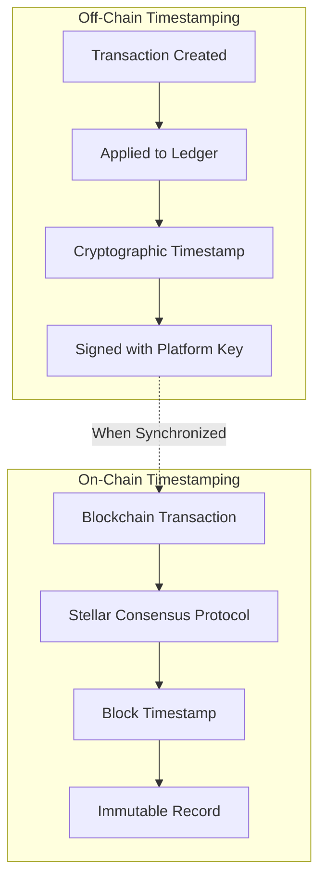

The off-chain timestamping system works as follows:

1. When a transaction is created, it receives a precise timestamp from the CVmine server
2. This timestamp is included in the transaction data and protected by the transaction's cryptographic signature
3. The timestamp's integrity is further ensured by the append-only structure of the transaction ledger
4. Periodic synchronization with the Stellar blockchain anchors these timestamps to a globally verifiable timeline

This approach ensures the temporal ordering of transactions while minimizing blockchain operation costs. The combination of secure off-chain timestamping with periodic blockchain anchoring prevents double-spending without requiring continuous blockchain integration.

## 4. Proof-of-Activity and the Stellar Consensus Protocol (SCP)

### 4.1 Overview of the Stellar Consensus Protocol

The CVmine platform utilizes the Stellar Consensus Protocol (SCP) as its underlying consensus mechanism for on-chain ITAL token operations. SCP represents a significant advancement over traditional blockchain consensus models, providing several crucial advantages for our professional development incentive system.

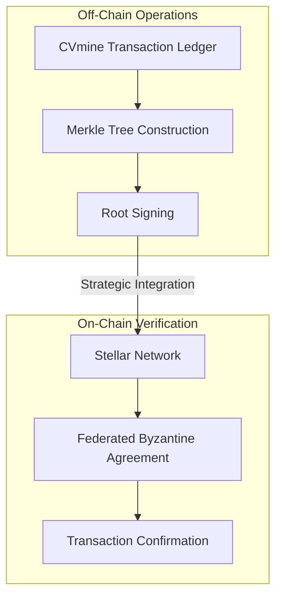

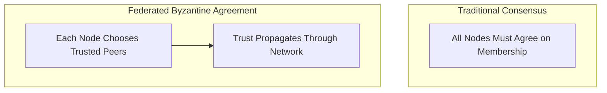

SCP is a construction of Federated Byzantine Agreement (FBA), a groundbreaking approach that achieves consensus without requiring unanimous agreement on network membership. Unlike traditional Byzantine Fault Tolerance (BFT) systems that necessitate complete agreement on participant identity, FBA allows each node to individually determine whom they trust, creating a more flexible, open, and decentralized network structure.

### 4.2 Technical Implementation of SCP

#### 4.2.1 Quorum Slices and Federated Voting

At the core of SCP is the concept of quorum slices. A quorum slice represents a subset of nodes that an individual validator trusts to provide accurate information. Each validator configures its own quorum slices independently, based on its assessment of trustworthiness. This creates a network topology where trust is both customizable and transitive.

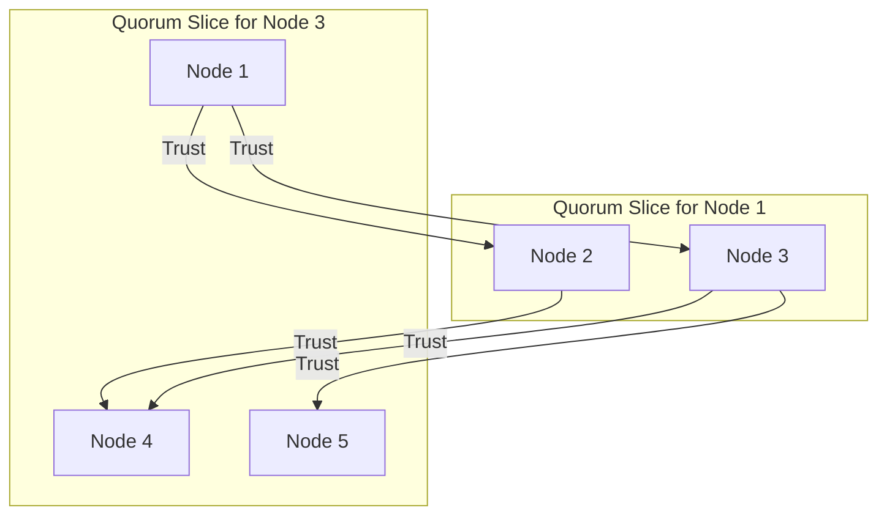

The quorum structure works as follows:
- A quorum is a set of nodes containing at least one quorum slice for each of its members
- Information propagates through these interconnected slices
- Consensus emerges when a sufficient number of overlapping quorum slices reach agreement

This architecture enables what is termed "federated voting," a multi-phase consensus process:

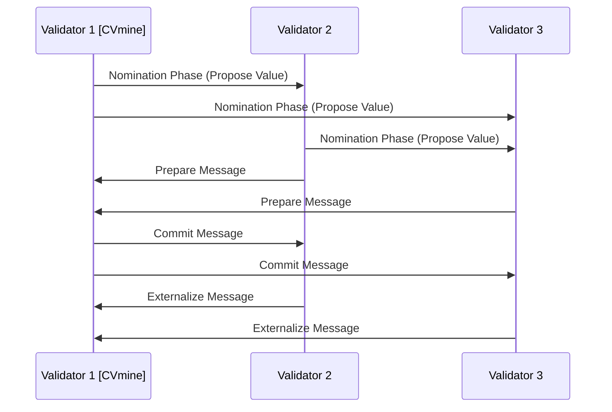

1. **Nomination Phase**: Validators propose candidate values for agreement
2. **Balloting Phase**: A structured voting process occurs through the following steps:
   - **Prepare Message**: Validators indicate which values they are voting on
   - **Commit Message**: Validators commit to values with sufficient support
   - **Externalize Message**: Validators confirm final agreement
   
Through this process, the network can achieve consensus even when some nodes are unavailable or behaving incorrectly, as long as a sufficient quorum of trusted nodes reaches agreement.

#### 4.2.2 Safety and Liveness Properties

SCP provides formal mathematical guarantees for two critical properties:

1. **Safety**: The protocol ensures that contradictory statements are never confirmed. This means that once consensus is reached on a transaction, it cannot be reversed or contradicted, preventing double-spending and maintaining ledger integrity.

2. **Liveness**: Under conditions where interconnected quorum slices exist and sufficient nodes are functioning correctly, the system will eventually confirm transactions. This ensures that the CVmine platform can continue processing ITAL token activity rewards even during partial network disruptions.

#### 4.2.3 Technical Implementation in the ITAL Ecosystem

For the ITAL token ecosystem on CVmine, SCP is implemented with the following technical considerations:

- **Validator Node Configuration**: Our initial network includes strategic validator nodes operated by CVmine and trusted partners, with configurations that ensure robust quorum intersection
- **Quorum Slice Configuration**: Each validator is configured with quorum slices that prioritize high-availability nodes with strong security practices
- **Tiered Trust Structure**: CVmine implements a hierarchical approach to quorum slice configuration that balances decentralization with operational reliability
- **Monitoring Systems**: Continuous monitoring of quorum health and network connectivity ensures early detection of potential consensus issues

#### 4.2.3.1 Validator Incentives

To ensure robust, decentralized network operation, the CVmine platform implements a multi-faceted validator incentive structure for ITAL tokens:

- **Transaction Fee Sharing**: Validators receive a portion of the minimal Stellar transaction fees for processing ITAL token operations
- **Participation Rewards**: A dedicated allocation of 0.5% of total ITAL supply is reserved for validator rewards distributed monthly
- **Reputation System**: Validators earn reputation scores based on uptime, performance, and honest participation
- **Tiered Service Agreements**: Enterprise validators receive service-level agreements with guaranteed compensation
- **Infrastructure Grants**: A development fund provides grants for validator infrastructure improvements
- **Priority Processing**: Validators receive priority for their own transactions within the network
- **Governance Voice**: Validators gain representation in protocol governance decisions proportional to their contribution
- **Partnership Benefits**: Institutional validators receive partnership benefits including visibility and integration opportunities

These incentives are carefully balanced to reward honest participation without creating centralization pressures. The model supports both institutional validators with significant resources and community validators contributing to network resilience.

### 4.3 Performance Characteristics

SCP enables exceptional performance metrics that are crucial for on-chain operations in our hybrid professional development incentive system:

- **Transaction Finality**: 3-5 seconds (compared to 10+ minutes for proof-of-work blockchains)
- **Throughput Capacity**: Approximately 1,000 transactions per second
- **Energy Efficiency**: Minimal computational requirements without mining
- **Transaction Cost**: Approximately 0.00001 XLM per transaction

These performance characteristics make SCP ideal for the blockchain integration component of the CVmine platform's ITAL token system, as it allows:
- Swift finalization of blockchain transactions when needed
- Scalable on-chain operations without transaction bottlenecks
- Economically viable microtransactions for small activity rewards when on-chain
- Sustainable operation without excessive energy consumption

### 4.4 Decentralization and Trust Considerations

While leveraging the benefits of SCP for on-chain operations, CVmine acknowledges important considerations regarding trust configuration:

1. **Quorum Configuration Risk**: Improper configuration of quorum slices could potentially lead to network splits or centralization
2. **Trust Topology Monitoring**: CVmine continuously analyzes the network's trust configuration to prevent centralization risks
3. **Gradual Decentralization**: The roadmap includes progressive expansion of the validator set to increase decentralization while maintaining network stability

To mitigate these considerations, CVmine implements:
- Transparent publication of all validator information
- Regular trust topology audits
- Documented guidelines for validator selection and quorum configuration
- A progressive roadmap for expanding the validator set

### 4.5 SCP Evolution

As the ITAL token ecosystem evolves on CVmine, advanced features of the Stellar Consensus Protocol will be implemented for on-chain operations:

1. **Tiered Quorums**: Different security requirements for different transaction types
2. **Dynamic Membership**: Protocols for safely adding and removing validators
3. **Enhanced Monitoring**: Advanced analytics to ensure optimal quorum health
4. **Formal Verification**: Ongoing verification of consensus security properties

By building on this sophisticated consensus protocol for blockchain operations while maintaining efficient off-chain processing for most transactions, the CVmine platform ensures secure, efficient, and cost-effective distribution of ITAL token rewards to users participating in job-seeking activities, without compromising on decentralization principles or transaction validation integrity.

## 5. Network Architecture

The ITAL token system operates through a sophisticated network architecture that balances off-chain efficiency with blockchain security.

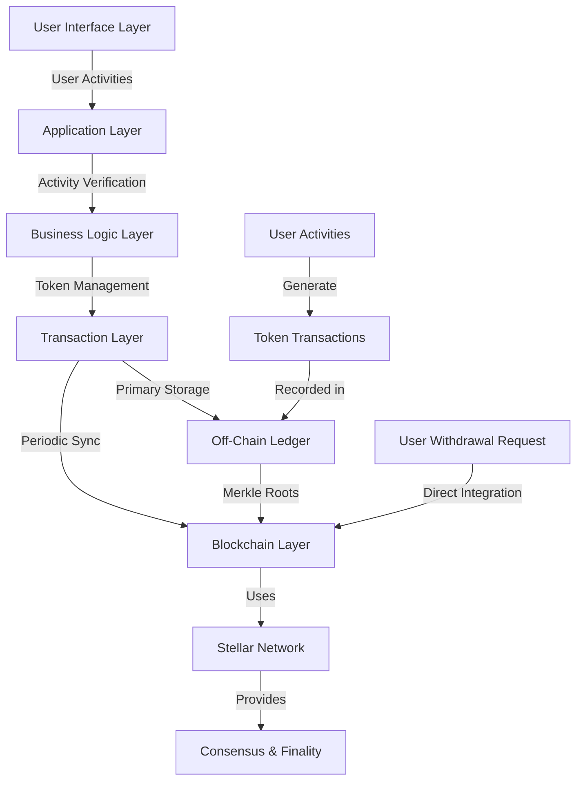

This network architecture consists of several key components:

1. **User Interface Layer**: Provides intuitive access to the CVmine platform and ITAL token functionality
2. **Application Layer**: Manages user interactions and coordinates with other system components
3. **Business Logic Layer**: Implements the rules for token generation, verification, and distribution
4. **Transaction Layer**: Processes and manages all token-related operations
5. **Off-Chain Ledger**: Serves as the primary record-keeping system for token transactions
6. **Blockchain Layer**: Provides strategic integration with the Stellar network for verification and external operations

This layered approach allows the system to operate primarily through efficient off-chain mechanisms while maintaining the option for blockchain integration when needed for security, verification, or external interoperability.

## 6. Wallet Infrastructure

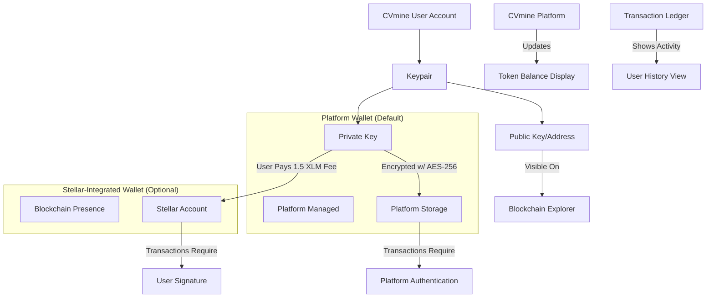

The ITAL token system on CVmine is built on a secure and efficient wallet infrastructure that combines **public-key cryptography**, the **Ed25519 signature scheme**, the **Stellar Consensus Protocol (SCP)**, and flexible **wallet options** to support scalable digital value transfer. Every CVmine user is assigned a cryptographic keypair—consisting of a **public key**, used to identify the account and verify transactions, and a **secret key**, used to authenticate actions and prove ownership. These keys are generated using Ed25519, a robust and efficient form of **Elliptic Curve Cryptography (ECC)**.

The CVmine platform implements a two-tier wallet infrastructure that balances user experience with blockchain integration options:

### 6.1 Platform Wallet (Default)

All CVmine users automatically receive a platform wallet that operates primarily off-chain. This wallet includes:

- **Balance Management**: Real-time tracking of token earnings and expenditures
- **Transaction History**: Comprehensive record of all token-related activities
- **User Interface**: Intuitive displays of balance and activity
- **Transfer Capability**: Ability to transfer tokens to other CVmine users
- **Service Payments**: Functionality to pay for premium CVmine services
- **Secure Key Storage**: Encrypted storage of the private key using **AES-256** at the application level

The platform wallet requires no blockchain integration or fees, allowing for immediate setup and a streamlined user experience. All transactions within this wallet are managed through the CVmine Transaction Ledger with cryptographic verification.

### 6.2 Stellar-Integrated Wallet (Optional)

Users can optionally upgrade to a Stellar-integrated wallet that provides additional capabilities:

- **Blockchain Presence**: Token holdings represented on the Stellar blockchain
- **External Transfers**: Ability to send tokens to external Stellar addresses
- **Third-Party Integration**: Compatibility with Stellar-based services and exchanges
- **Trustless Verification**: Independent verification without relying on CVmine

Upgrading to a Stellar-integrated wallet requires:

1. User's explicit request for blockchain integration
2. Payment of the 1.5 XLM fee (covering the 1 XLM minimum reserve + transaction fees)
3. Completion of any required verification procedures

### 6.3 Wallet Migration Strategy

The CVmine platform's migration from platform wallets to Stellar-integrated wallets follows a carefully structured approach:

#### 6.3.1 Phased Implementation

1. **Education Phase** (Months 1-3): Comprehensive user education about wallet security, private key management, and the benefits/risks of self-custody
2. **Opt-in Beta** (Months 4-6): Limited release to technically proficient users who explicitly opt-in
3. **Hybrid Period** (Months 7-18): Both wallet types available, with gradual feature parity development
4. **Guided Migration** (Months 19-24): Guided transition for users who wish to move to Stellar-integrated wallets
5. **Platform Wallet Legacy Support** (Ongoing): Maintained support for users who prefer or require platform wallets

#### 6.3.2 Technical Implementation

The migration process preserves user assets and identity through these security-focused procedures:

- **Secure Key Generation**: Private keys for Stellar-integrated wallets are generated using secure key derivation functions
- **Multi-signature Transition**: During migration, accounts temporarily use a 2-of-2 multisignature structure requiring both user and CVmine platform authorization
- **Verifiable Recovery Options**: Users configure recovery mechanisms with optional trusted contacts
- **Progressive Security Model**: Users gradually receive more control as they demonstrate security awareness
- **Interface Consistency**: The user experience remains similar, despite the underlying custody changes
- **Zero-knowledge Proofs**: Implementation of zero-knowledge techniques to allow platform assistance without custody

#### 6.3.3 User Experience Considerations

To ensure successful migration, the CVmine platform addresses key user experience factors:

- **Simplified Key Management**: Integration with user-friendly key management solutions and hardware wallets
- **Guided Setup Process**: Step-by-step wizard for wallet setup with verification checkpoints
- **Recovery Rehearsals**: Simulated recovery processes to ensure users can successfully restore access
- **Incentive Structure**: Token rewards for completing security best practice actions
- **Transaction Simulation**: Practice environment for users to understand transaction signing
- **Continuous Support**: Dedicated support channels for migration-related questions

This comprehensive wallet infrastructure balances the efficiency of platform wallets with the security and autonomy benefits of Stellar-integrated wallets, allowing each user to choose the approach that best suits their needs.

## 7. Token Value Mechanisms

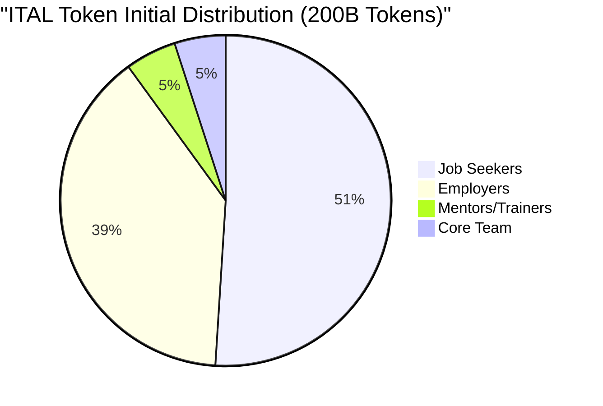

The ITAL token employs a fixed distribution model with an initial mint of 200 billion tokens allocated as follows: 51% to job seekers, 39% to employers, 5% to mentors and trainers, and 5% to the core development team. The total token supply is capped at 6 trillion ITAL, with a precision of up to seven decimal places. Tokens are generated solely through user activity on the CVmine platform, ensuring a direct correlation between value creation and value distribution. 

```mermaid
graph TD
    A[Token Utility on CVmine] --> B[Premium Certifications]
    A --> C[Enhanced Profile Features]
    A --> D[Training Resources]
    A --> E[Membership Tiers]
    
    F[Value Stability] --> G[Activity-Based Generation]
    F --> H[2% Token Burn]
    F --> I[Minimum Balance Rewards]
    F --> J[5% Reserve Fund]
    F --> K[Buy-Back Program]
    F --> L[Staking Rewards]
    
    M[CVmine Activities] --> N[Sign Up: 100 ITAL]
    M --> O[Referral: 20 ITAL]
    M --> P[CV Download by Employer: 1 ITAL]
    M --> Q[Job Application: 1 ITAL]
    M --> R[CV Design: 50 ITAL]
    M --> S[Training Program Application: 2 ITAL]
    M --> T[CV Download by Trainer: 2 ITAL]
```

The token holds utility in various ways on the CVmine platform—users can spend ITAL for premium certification programs, enhanced job profile features, access to training resources, and membership tiers that unlock additional benefits based on their holdings. To enforce scarcity and maintain long-term value, the system incorporates several mechanisms: token generation is exclusively tied to verifiable human effort, 2% of tokens used for premium services are burned to reduce supply, and users are rewarded for maintaining minimum token balances. Furthermore, ITAL's value stability is maintained through a reserve fund holding 5% of the initially minted tokens, a buy-back program funded by CVmine platform revenue to stabilize market fluctuations, and staking rewards offering an annual yield to users who lock their tokens for set periods.

### 7.1 CVmine Reward Structure

The CVmine platform implements a comprehensive reward structure that tokenizes value creation across all aspects of the job search process:

```mermaid
graph TD
    A[CVmine Activity Categories] --> B[Profile Creation]
    A --> C[Platform Engagement]
    A --> D[Job Application]
    A --> E[Learning & Development]
    A --> F[Network Building]
    
    B --> G[Complete Profile: 100 ITAL]
    B --> H[CV Design: 50 ITAL]
    B --> I[Skill Assessment: 25 ITAL]
    
    C --> J[Daily Login: 5 ITAL]
    C --> K[Content Sharing: 10 ITAL]
    C --> L[Forum Participation: 15 ITAL]
    
    D --> M[Job Application: 1 ITAL]
    D --> N[Interview Completion: 20 ITAL]
    D --> O[Feedback Submission: 5 ITAL]
    
    E --> P[Course Completion: 30 ITAL]
    E --> Q[Certification: 50 ITAL]
    E --> R[Skill Endorsement: 5 ITAL]
    
    F --> S[New Referral: 20 ITAL]
    F --> T[Mentor Connection: 15 ITAL]
    F --> U[Community Contribution: 25 ITAL]
```

Each activity on the CVmine platform generates a specific ITAL token reward, creating a comprehensive incentive system that rewards all forms of positive engagement. The reward structure is designed to recognize both small, frequent activities and significant milestone achievements, ensuring users are continuously motivated to engage with the platform in meaningful ways.

The transaction ledger maintained by CVmine provides detailed records of all token-generating activities, including the specific activity category, token amount, and transaction status. This detailed tracking enables precise accounting of token distribution while providing valuable analytics regarding user engagement patterns.

## 8. Privacy

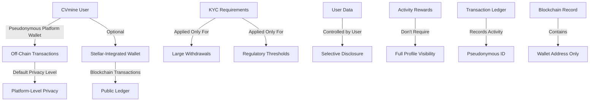

The ITAL token system on CVmine prioritizes user privacy by adopting a more secure and user-centric approach compared to traditional job-seeking systems. Instead of exposing sensitive personal information, the CVmine platform allows users to interact through pseudonymous identifiers. This ensures that individuals can earn rewards and participate in the ecosystem without fully revealing their identity or personal data. Users have complete control over what information they choose to share, and rewards for platform activity do not require full profile visibility. 

The CVmine transaction ledger maintains privacy by associating activities with pseudonymous identifiers rather than directly linking to personally identifiable information. When transactions are settled to the blockchain, only the wallet addresses and token amounts are recorded, maintaining user privacy at the blockchain level.

Despite this commitment to privacy, the CVmine platform maintains regulatory compliance by implementing Know Your Customer (KYC) procedures specifically for token withdrawals above regulatory thresholds, ensuring both security and adherence to legal standards.

## 9. Calculations

```mermaid
graph LR
    A[Users] -->|u| B[CVmine Activities]
    B -->|a| C[Reward Rate]
    C -->|r| D[Token Distribution]
    
    A -->|u| E[Service Usage]
    E -->|s| F[Service Cost]
    F -->|c| G[Token Consumption]
    
    D --- H{Equilibrium}
    G --- H
    
    H -->|u×a×r = u×s×c| I[Balanced Economy]
    H -->|u×a×r < u×s×c| J[Deflationary]
    H -->|u×a×r > u×s×c| K[Inflationary]
```

To maintain the economic stability of the ITAL token ecosystem, a mathematical model is used to balance token distribution with service usage. The CVmine platform calculates equilibrium based on the equation: *u × a × r = u × s × c*, where *u* represents the number of users, *a* is the average number of activities performed, *r* is the reward rate, *s* is the service utilization rate, and *c* is the average cost of services. This formula ensures that the rate at which tokens are distributed through user activity on CVmine is matched by the rate at which tokens are used within the platform. For long-term sustainability, the platform aims to keep the reward distribution at or below the token consumption rate (*u × a × r ≤ u × s × c*), preventing inflation and maintaining the token's value as the user base grows.

The CVmine transaction ledger provides valuable data for continuously monitoring and adjusting this economic balance. By analyzing the rate of token generation across different activity types and the patterns of token usage for premium services, the CVmine platform can make data-driven adjustments to reward rates and service costs to maintain optimal economic equilibrium.

## 10. Technical Implementation

### 10.1 Off-Chain Ledger Implementation

The off-chain transaction ledger is implemented using a sophisticated stack of technologies designed for security, performance, and reliability:

```mermaid
graph TD
    A[Technology Stack] --> B[Database Layer]
    A --> C[Application Layer]
    A --> D[Security Layer]
    A --> E[Integration Layer]
    
    B --> F[PostgreSQL Cluster]
    B --> G[TimescaleDB Extension]
    B --> H[Redis Cache]
    
    C --> I[Node.js Services]
    C --> J[Transaction Processing Engine]
    C --> K[Event Sourcing Framework]
    
    D --> L[HSM Integration]
    D --> M[Key Management Service]
    D --> N[Encryption Framework]
    
    E --> O[Stellar SDK]
    E --> P[API Gateway]
    E --> Q[Webhook Service]
```

#### 10.1.1 Database Implementation

The transaction ledger's database layer leverages:

- **PostgreSQL**: Enterprise-grade relational database for reliable transaction management
- **TimescaleDB**: Extension for efficient time-series data handling
- **Partitioning**: Horizontal partitioning by date and user ID for performance
- **Indexing Strategy**: Optimized indexes for frequent query patterns
- **Replication**: Synchronous multi-node replication for redundancy
- **Point-in-Time Recovery**: Continuous archiving of write-ahead logs
- **Redis Cache**: In-memory caching for frequently accessed data

#### 10.1.2 Application Services

The application layer managing the ledger consists of:

- **Microservice Architecture**: Discrete services for transaction processing, user management, verification, and synchronization
- **Event Sourcing**: Recording all changes as a series of immutable events
- **CQRS Pattern**: Separation of command and query responsibilities
- **Idempotent Processing**: Safe handling of duplicate requests
- **Circuit Breakers**: Graceful handling of dependency failures
- **Horizontal Scaling**: Ability to add processing nodes as demand increases
- **Zero-Downtime Deployment**: Continuous operation during updates

#### 10.1.3 Security Implementation

The security layer incorporates:

- **Hardware Security Modules (HSMs)**: FIPS 140-2 Level 3 certified devices for cryptographic operations
- **Key Rotation**: Regular rotation of encryption and signing keys
- **Multi-Layer Encryption**: Data encrypted at rest and in transit
- **Access Control**: Fine-grained permissions with least privilege principle
- **Audit Logging**: Tamper-evident logging of all administrative actions
- **Intrusion Detection**: Real-time monitoring for suspicious activities
- **Threat Modeling**: Continuous assessment of potential attack vectors

#### 10.1.4 Blockchain Integration Implementation

The integration with Stellar is managed through:

- **Stellar SDK**: Official libraries for blockchain interaction
- **Transaction Construction**: Formation of valid Stellar transactions
- **Multi-Signature Support**: Implementation of threshold signatures
- **Horizon API Integration**: Interface with Stellar's public API
- **Testnet Environment**: Testing infrastructure before mainnet deployment
- **Fallback Mechanisms**: Handling of network disruptions
- **Fee Management**: Dynamic adjustment to network conditions

### 10.2 Scaling Strategy

The system is designed to scale efficiently with growing user activity:

```mermaid
graph TD
    A[Scaling Dimensions] --> B[Horizontal Scaling]
    A --> C[Vertical Scaling]
    A --> D[Data Partitioning]
    A --> E[Load Distribution]
    
    B --> F[Service Replication]
    B --> G[Read Replicas]
    
    C --> H[Resource Expansion]
    C --> I[Performance Optimization]
    
    D --> J[Time-Based Partitioning]
    D --> K[User-Based Sharding]
    
    E --> L[Load Balancing]
    E --> M[Geographic Distribution]
```

This scaling strategy enables the platform to efficiently handle millions of users and billions of transactions while maintaining performance and reliability. As user activity increases, the system can adapt by adding resources, optimizing data management, and distributing processing across multiple nodes.

### 10.3 Disaster Recovery and Business Continuity

The platform implements comprehensive disaster recovery procedures:

```mermaid
graph TD
    A[Disaster Recovery] --> B[Backup Strategies]
    A --> C[Redundancy Measures]
    A --> D[Recovery Procedures]
    A --> E[Testing Regime]
    
    B --> F[Real-time Replication]
    B --> G[Point-in-Time Backups]
    B --> H[Off-site Storage]
    
    C --> I[Geographic Distribution]
    C --> J[Multi-Zone Deployment]
    C --> K[Alternative Providers]
    
    D --> L[Automated Recovery]
    D --> M[Manual Procedures]
    D --> N[Communication Plans]
    
    E --> O[Regular DR Drills]
    E --> P[Scenario Testing]
    E --> Q[Continuous Improvement]
```

These measures ensure that even in catastrophic failure scenarios, the integrity of the transaction ledger can be maintained and service restored within established recovery time objectives.

## 11. Conclusion

```mermaid
graph TD
    A[ITAL Token on CVmine] --> B[Immediate Benefits]
    A --> C[Future Evolution]
    
    B --> D[Direct Activity Rewards]
    B --> E[Fair Value Distribution]
    B --> F[Reduced Platform Dependency]
    B --> G[Cost Efficiency]
    B --> H[Scalability]
    
    C --> I[Peer Verification Systems]
    C --> J[Reputation-Based Trust]
    C --> K[Reduced Centralized Oversight]
    C --> L[Enhanced User Autonomy]
    C --> M[Increased Decentralization]
    
    N[CVmine Platform] -->|Powers| O[Job Search Activities]
    O -->|Generate| P[ITAL Tokens]
    P -->|Incentivize| N
```

In conclusion, we have introduced a decentralized incentive-based system integrated with the CVmine platform, designed to support professional development and job-seeking efforts without depending on the goodwill or control of a centralized authority. By utilizing the ITAL token within a hybrid off-chain/on-chain architecture, users are directly rewarded for meaningful activities such as learning, upskilling, and applying for jobs on CVmine. This approach ensures that value creation within the platform is transparently and fairly aligned with value distribution.

Our hybrid approach provides the best of both worlds—the efficiency and low cost of off-chain operations combined with the security and interoperability of blockchain technology when needed. The transaction ledger enables immediate token rewards and efficient processing of high-frequency micro-transactions, while the option for Stellar blockchain integration provides external verification and withdrawal capabilities for users who require them.

The integration of ITAL tokens with the CVmine platform creates a virtuous cycle where user activities generate tangible rewards, which in turn incentivize further engagement. The comprehensive transaction ledger provides the technical foundation for this integration, enabling immediate token rewards while leveraging the security and transparency of the Stellar blockchain at strategic points.

The ITAL ecosystem establishes a robust framework for recognizing and incentivizing individual effort, while simultaneously laying the foundation for a sustainable, scalable, and self-sufficient digital environment. Although the CVmine platform initially verifies user activities to maintain integrity, future iterations aim to reduce centralized oversight by incorporating decentralized verification methods, such as peer reviews and reputation-based systems. This evolution will further empower users and enhance trust, accountability, and autonomy within the ecosystem.

By charging users only when they specifically request blockchain integration, the system ensures that costs are fairly allocated while maintaining accessibility for all participants. This approach maximizes efficiency while providing each user with the level of blockchain integration that suits their specific needs.

By rewarding job seekers for their contributions to the platform, CVmine and ITAL transform the traditional job search process into a value-generating activity for all participants. This innovative approach aligns incentives between job seekers, employers, and the platform itself, creating a more equitable and efficient professional development ecosystem.
