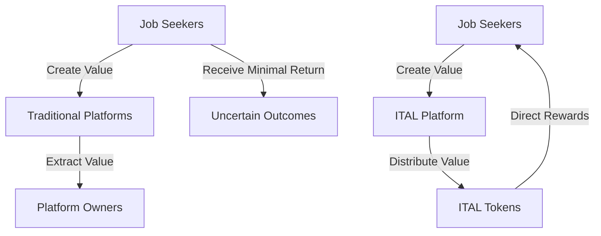
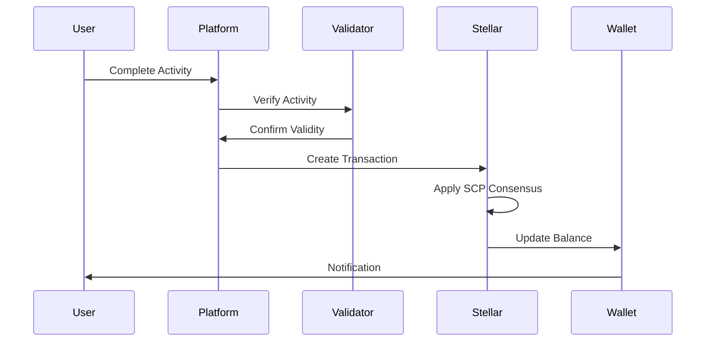
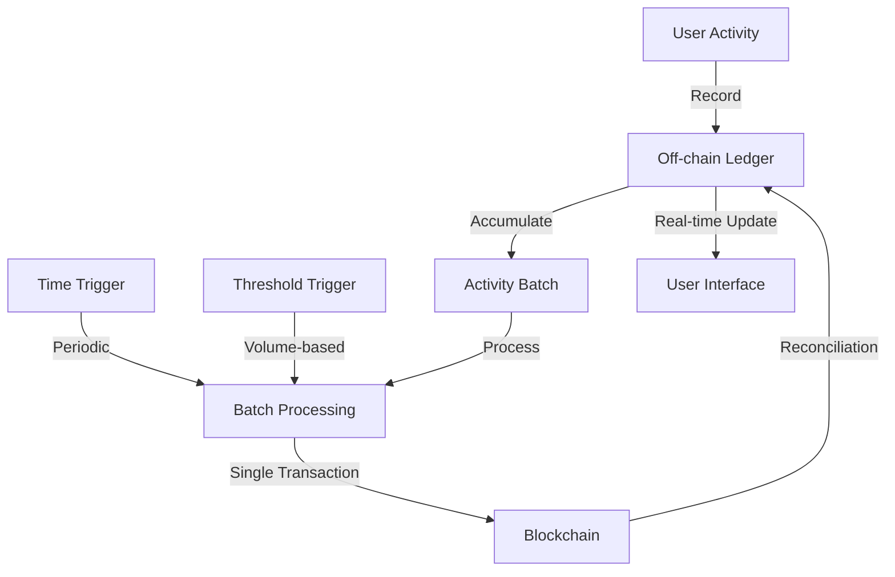
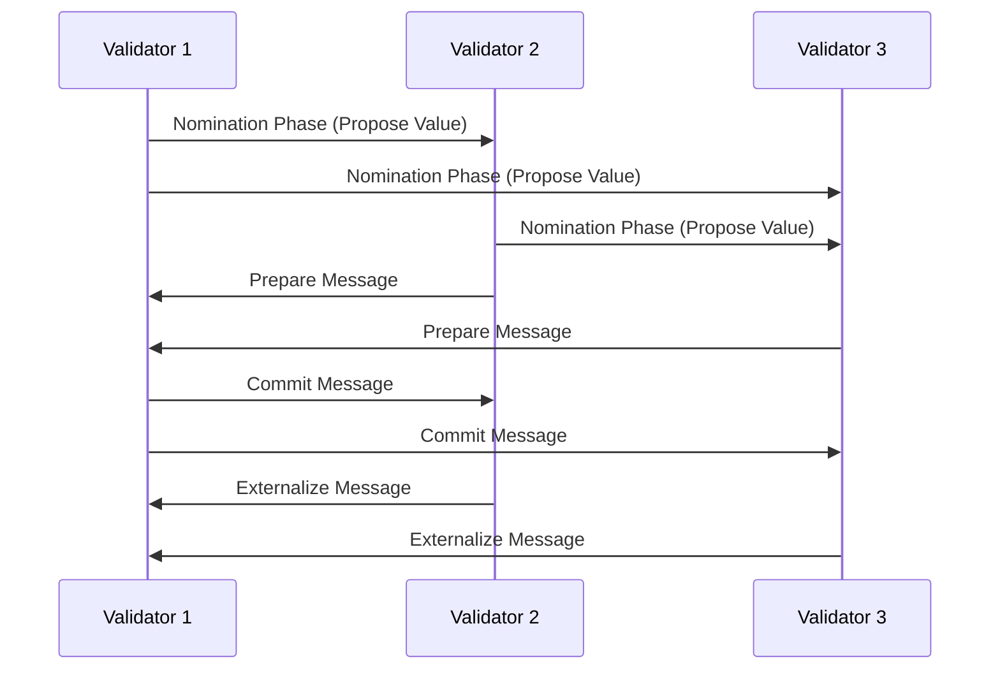
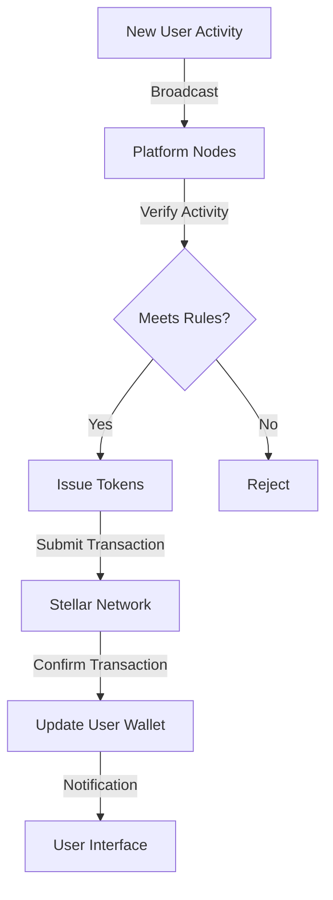
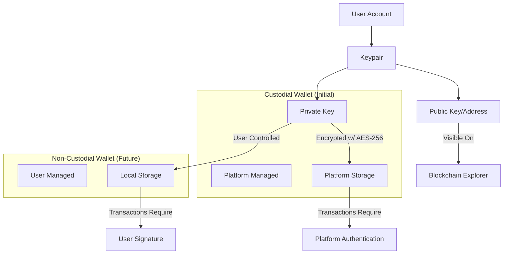
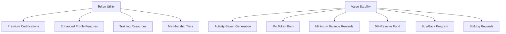
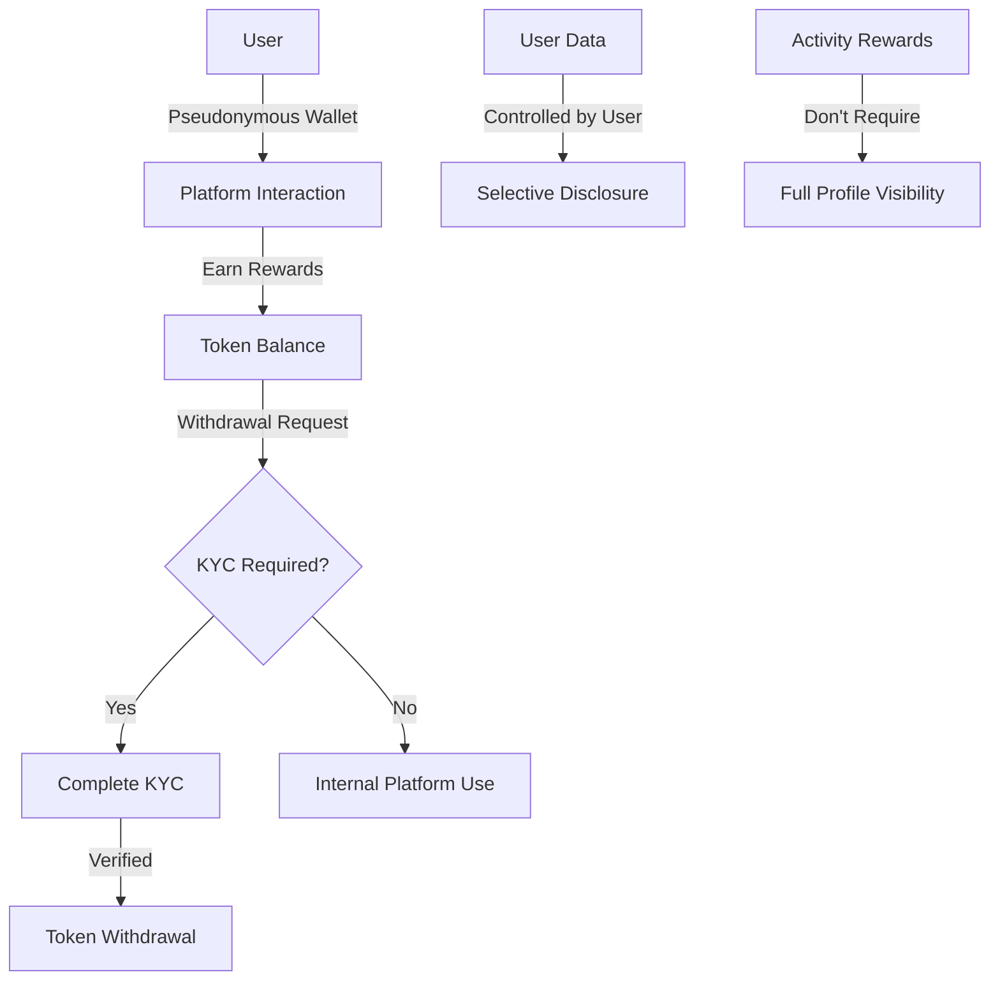
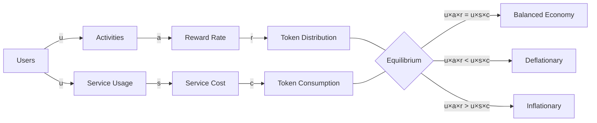
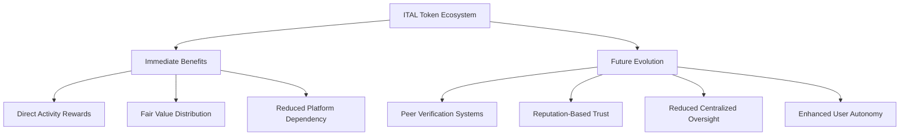

# ITAL Token: A Peer-to-Peer Incentive System for Professional Development

## Abstract

We propose a peer-to-peer incentive system for professional development activities. The system enables participants to earn rewards for job-seeking and career advancement efforts without relying on the goodwill of platforms or employers. ITAL tokens are generated and distributed through active participation in platform activities, with transactions recorded on the Stellar blockchain. The system operates using a custodial wallet infrastructure initially, with planned migration to non-custodial solutions. We define rules that incentivize participation while preventing manipulation of the reward mechanism. The result is a decentralized network of job seekers and professionals that creates and exchanges value through meaningful engagement.

## 1. Introduction

Traditional job search platforms operate on a model where users provide substantial value through data, content creation, and engagement while receiving little proportional reward. Even as digital job marketplaces have grown, the fundamental incentive structures remain tilted away from job seekers, who invest significant time and effort with uncertain returns.

We define a job seeker's digital currency as a chain of digital signatures. Each participant transfers value to the next by digitally signing a hash of the previous transaction and the public key of the next owner and adding these to the end of the token. A recipient can verify the signatures to verify the chain of ownership.

The problem is that the recipient cannot verify that one of the owners did not double-spend the token. A common solution is to introduce a trusted central authority, or mint, that checks every transaction for double spending. After each transaction, the token must be returned to the mint to issue a new token, and only tokens issued directly from the mint are trusted not to be double-spent. The problem with this solution is that the entire monetary system depends on the company running the mint, with every transaction having to go through them.

We need a way for job seekers to be able to earn and transfer value without depending on centralized platforms that may extract disproportionate value. Our solution begins with a timestamp server. A timestamp server works by taking a hash of a block of items to be timestamped and widely publishing the hash. Each timestamp includes the previous timestamp in its hash, forming a chain.

## 2. Transactions

We define an ITAL token as a chain of digital signatures on the Stellar blockchain. Each transaction represents a transfer of value triggered by verifiable user activity. The Stellar blockchain serves as the immutable public ledger that records all token movements within the ecosystem.

Each ITAL transaction consists of several critical components working together. The platform's issuing account serves as the source account, while the job seeker's wallet address functions as the destination account. The transaction specifies ITAL tokens as the asset type, with the quantity determined by the specific activity's value. All transactions utilize Stellar's payment operation type, include an activity identifier memo for transparency, and carry the issuing account's digital signature for authentication.

When a job seeker completes a valuable activity, a specific transaction sequence unfolds. First, the system validates that the user activity meets quality and authenticity requirements through automated checks. Next, the system calculates the appropriate token reward based on the activity type and quality metrics. The platform then constructs a Stellar transaction specifying the destination and amount, signs it with its private key, and submits the signed transaction to the Stellar network. Stellar validators confirm the transaction's validity before permanently recording it in the Stellar ledger. Finally, the user's wallet balance updates to reflect the new token amount.

The system recognizes and rewards various professional development activities with specific token values. Users receive **100 ITAL** for signing up as a jobseeker, and **20 ITAL** for each referral. **1 ITAL** is awarded for each CV download by employers, as well as for applying to job alerts. Jobseekers earn **50 ITAL** for designing a CV. Applications to training programs and CV downloads by training providers are each rewarded with **2 ITAL**.

Transaction security relies on **Stellar's robust cryptographic infrastructure**. All transactions require valid signatures from authorized issuing accounts, with private keys secured through **AES-256 encryption**. Unauthorized transaction attempts are automatically rejected, and **rate limiting** prevents flooding. For high-value operations, **multi-signature requirements** can be implemented as an added layer of protection. Each transaction is recorded on the **Stellar blockchain**, ensuring transparency and immutability. Stellar's native capabilities maintain transaction integrity while keeping fees extremely low — approximately **0.00001 XLM** per transaction.

## 2.1 Efficient Transaction Processing

While the Stellar blockchain provides an efficient foundation for our token economy, creating individual blockchain transactions for every platform activity would be inefficient and costly at scale. Instead, the ITAL platform implements a hybrid approach combining off-chain ledgers with periodic blockchain reconciliation.

### 2.1.1 Off-chain Transaction Pool

The platform maintains a secure, redundant off-chain ledger system that records all user activities and associated token transfers in real-time. This approach provides several advantages:

- **Instant Feedback**: Users receive immediate confirmation of earned tokens without blockchain latency
- **Cost Efficiency**: Platform operation costs are significantly reduced by minimizing blockchain transactions
- **Scalability**: The system can handle millions of micro-activities without blockchain throughput limitations
- **Reduced Network Load**: The Stellar network remains unburdened by high-frequency small transactions

### 2.1.2 Batch Settlement Process

The off-chain ledger periodically settles accumulated transactions to the Stellar blockchain through an intelligent batching mechanism:

1. **Accumulation Phase**: User activities and associated token transfers are recorded in the secure off-chain ledger
2. **Trigger Conditions**: Batch settlement occurs primarily when a user reaches 1,000 transactions, with additional triggers including:
   - Time-based triggers (e.g., weekly settlements regardless of volume)
   - Value-based triggers (e.g., when total value exceeds 100,000 ITAL)
   - Administrative triggers (e.g., end of financial reporting periods)
3. **Aggregation Logic**: Transactions are intelligently combined to optimize for:
   - Net transfers between accounts (minimizing operations)
   - Transaction fee efficiency
   - Data storage requirements
4. **Blockchain Commitment**: A single Stellar transaction containing the aggregated state changes is submitted to the blockchain
5. **Verification and Reconciliation**: The system confirms the blockchain settlement and reconciles the off-chain ledger

#### 2.1.2.1 Settlement Timing Strategy

The platform's primary settlement strategy revolves around per-user transaction thresholds:

- **Per-User Batching**: Each user's transactions are tracked independently, with settlement occurring upon reaching 1,000 activities
- **Variable Frequency**: High-activity users experience more frequent settlements than occasional users
- **Randomized Offset**: Small random variations in the exact settlement threshold (±5%) prevent timing-based exploitation
- **Activity Categorization**: Different weights are assigned to various activities when counting toward the threshold
- **Intelligent Grouping**: Users with interrelated transactions are batched together when possible to maximize efficiency
- **Optimized Settlement Windows**: Settlements are scheduled during periods of low Stellar network congestion
- **Interleaved Processing**: Multiple user batches are processed in parallel to prevent bottlenecks

This user-centric approach to settlement timing balances efficiency, security, and user experience while preventing exploitation of predictable settlement cycles. By focusing on per-user transaction counts rather than fixed time periods, the system naturally adapts to varying levels of platform activity.

### 2.1.3 Security Considerations

This hybrid approach maintains the security benefits of blockchain while improving efficiency:

- **Cryptographic Integrity**: The off-chain ledger maintains cryptographic signatures for all entries
- **Transparent Reconciliation**: Users can verify that off-chain balances match blockchain state
- **Tamper Evidence**: Any discrepancy between reported balances and blockchain state would be detectable
- **Disaster Recovery**: The blockchain serves as the authoritative record in case of system failure
- **Dispute Resolution**: The immutable blockchain record provides the basis for resolving any disputes

#### 2.1.3.1 Off-chain Ledger Security

The off-chain ledger implementation incorporates multiple security layers to maintain integrity between blockchain settlements:

- **Distributed Database Architecture**: The ledger operates across multiple geographically dispersed nodes with real-time replication
- **Multi-level Encryption**: All stored transactions use AES-256 encryption at rest and TLS 1.3 for data in transit
- **Digital Signatures**: Every transaction is signed by the platform using Ed25519 signatures, creating a verifiable audit trail
- **Immutable Append-only Structure**: Like blockchain, the off-chain ledger only allows adding new records, never modifying existing ones
- **Regular Cryptographic Attestations**: The platform publishes periodic Merkle tree roots of the off-chain ledger to the blockchain
- **Comprehensive Audit Logging**: All administrative actions are logged with tamper-evident mechanisms
- **Hardware Security Module (HSM) Integration**: Critical cryptographic operations use FIPS 140-2 Level 3 compliant HSMs

#### 2.1.3.2 Trust Considerations

The hybrid architecture requires a carefully balanced trust model:

- **Bounded Trust Window**: Users need only trust the platform between settlement periods, not indefinitely
- **Verifiable Pending Transactions**: All off-chain transactions provide cryptographic receipts that users can independently verify
- **Transparency Portal**: A real-time dashboard shows the current state of the off-chain ledger and pending settlements
- **Forced Settlement Option**: High-value users can trigger immediate settlement of their transactions for a small fee
- **Trust Minimization**: The architecture is designed to minimize, not eliminate, required trust through verifiable processes
- **Regulatory Oversight**: Regular third-party audits verify the integrity of the off-chain ledger systems

#### 2.1.3.3 Dispute Resolution

The platform implements a structured dispute resolution process:

1. **Automated Verification**: Initial disputes trigger automatic verification against cryptographic receipts
2. **Evidence Collection**: The system preserves transaction records, communications, and audit logs related to the dispute
3. **Tiered Resolution Process**:
   - Level 1: Automated reconciliation through the platform
   - Level 2: Review by platform support personnel
   - Level 3: Assessment by independent third-party arbitrators
4. **Smart Contract Arbitration**: Critical disputes can leverage Stellar's multisignature capabilities for trustless resolution
5. **Time-Bounded Process**: All disputes follow strict timelines to ensure prompt resolution
6. **Blockchain Evidence**: The immutable nature of settled transactions provides definitive evidence for dispute resolution

#### 2.1.3.4 Advanced Recovery Procedures

In the event of a major system failure or compromise, the platform implements these recovery procedures:

1. **Immediate Suspension**: Upon detection of anomalies, the system temporarily suspends new off-chain transactions
2. **State Verification**: All user balances are verified against the last blockchain settlement and cryptographic receipts
3. **Differential Analysis**: The system performs a comprehensive comparison between the off-chain ledger and verified records
4. **Secure Reconstruction**: If necessary, the off-chain ledger is reconstructed from the last valid state using backup systems
5. **Progressive Reactivation**: The system resumes operations in phases, prioritizing verification over new transactions
6. **Transparent Communication**: Throughout the recovery process, users receive clear updates on the status and impact
7. **Post-Incident Analysis**: After resolution, a detailed report identifies root causes and implements preventative measures

### 2.1.4 User Experience

From the user perspective, this architecture provides a seamless experience:

- Activities generate immediate token rewards visible in their wallet
- Blockchain confirmations occur in the background without user intervention
- Transaction history distinguishes between pending (off-chain only) and confirmed (on-chain) transactions
- Users can request expedited settlement for large transactions if needed

By implementing this hybrid on-chain/off-chain architecture, the ITAL token system achieves the benefits of blockchain security and decentralization while maintaining the performance, cost-efficiency, and responsiveness required for a high-volume professional development platform.

## 3. Timestamp Server

We implement timestamping through the Stellar consensus protocol, which provides a secure, Byzantine fault-tolerant mechanism for transaction validation. Each block of transactions on the Stellar ledger includes a timestamp and reference to the previous block, creating a verifiable chronological chain.

This approach solves the double-spending problem without requiring a trusted central authority. Once an activity reward is recorded in the blockchain, that specific reward cannot be claimed again by the same user.

## 4. Proof-of-Activity and the Stellar Consensus Protocol (SCP)

### 4.1 Overview of the Stellar Consensus Protocol

The ITAL token platform utilizes the Stellar Consensus Protocol (SCP) as its underlying consensus mechanism. SCP represents a significant advancement over traditional blockchain consensus models, providing several crucial advantages for our professional development incentive system.

SCP is a construction of Federated Byzantine Agreement (FBA), a groundbreaking approach that achieves consensus without requiring unanimous agreement on network membership. Unlike traditional Byzantine Fault Tolerance (BFT) systems that necessitate complete agreement on participant identity, FBA allows each node to individually determine whom they trust, creating a more flexible, open, and decentralized network structure.

### 4.2 Technical Implementation of SCP

#### 4.2.1 Quorum Slices and Federated Voting

At the core of SCP is the concept of quorum slices. A quorum slice represents a subset of nodes that an individual validator trusts to provide accurate information. Each validator configures its own quorum slices independently, based on its assessment of trustworthiness. This creates a network topology where trust is both customizable and transitive.

The quorum structure works as follows:
- A quorum is a set of nodes containing at least one quorum slice for each of its members
- Information propagates through these interconnected slices
- Consensus emerges when a sufficient number of overlapping quorum slices reach agreement

This architecture enables what is termed "federated voting," a multi-phase consensus process:

1. **Nomination Phase**: Validators propose candidate values for agreement
2. **Balloting Phase**: A structured voting process occurs through the following steps:
   - **Prepare Message**: Validators indicate which values they are voting on
   - **Commit Message**: Validators commit to values with sufficient support
   - **Externalize Message**: Validators confirm final agreement
   
Through this process, the network can achieve consensus even when some nodes are unavailable or behaving incorrectly, as long as a sufficient quorum of trusted nodes reaches agreement.

#### 4.2.2 Safety and Liveness Properties

SCP provides formal mathematical guarantees for two critical properties:

1. **Safety**: The protocol ensures that contradictory statements are never confirmed. This means that once consensus is reached on a transaction, it cannot be reversed or contradicted, preventing double-spending and maintaining ledger integrity.

2. **Liveness**: Under conditions where interconnected quorum slices exist and sufficient nodes are functioning correctly, the system will eventually confirm transactions. This ensures that the ITAL token platform can continue processing activity rewards even during partial network disruptions.

#### 4.2.3 Technical Implementation in the ITAL Ecosystem

For the ITAL token ecosystem, we implement SCP with the following technical considerations:

- **Validator Node Configuration**: Our initial network includes strategic validator nodes operated by the platform and trusted partners, with configurations that ensure robust quorum intersection
- **Quorum Slice Configuration**: Each validator is configured with quorum slices that prioritize high-availability nodes with strong security practices
- **Tiered Trust Structure**: We implement a hierarchical approach to quorum slice configuration that balances decentralization with operational reliability
- **Monitoring Systems**: Continuous monitoring of quorum health and network connectivity ensures early detection of potential consensus issues

#### 4.2.3.1 Validator Incentives

To ensure robust, decentralized network operation, the ITAL ecosystem implements a multi-faceted validator incentive structure:

- **Transaction Fee Sharing**: Validators receive a portion of the minimal Stellar transaction fees for processing ITAL token operations
- **Participation Rewards**: A dedicated allocation of 0.5% of total ITAL supply is reserved for validator rewards distributed monthly
- **Reputation System**: Validators earn reputation scores based on uptime, performance, and honest participation
- **Tiered Service Agreements**: Enterprise validators receive service-level agreements with guaranteed compensation
- **Infrastructure Grants**: A development fund provides grants for validator infrastructure improvements
- **Priority Processing**: Validators receive priority for their own transactions within the network
- **Governance Voice**: Validators gain representation in protocol governance decisions proportional to their contribution
- **Partnership Benefits**: Institutional validators receive partnership benefits including visibility and integration opportunities

These incentives are carefully balanced to reward honest participation without creating centralization pressures. The model supports both institutional validators with significant resources and community validators contributing to network resilience.

### 4.3 Performance Characteristics

SCP enables exceptional performance metrics that are crucial for a responsive professional development incentive system:

- **Transaction Finality**: 3-5 seconds (compared to 10+ minutes for proof-of-work blockchains)
- **Throughput Capacity**: Approximately 1,000 transactions per second
- **Energy Efficiency**: Minimal computational requirements without mining
- **Transaction Cost**: Approximately 0.00001 XLM per transaction

These performance characteristics make SCP ideal for the ITAL token platform, as it allows:
- Real-time distribution of activity rewards
- Scalable user onboarding without transaction bottlenecks
- Economically viable microtransactions for small activity rewards
- Sustainable operation without excessive energy consumption

### 4.4 Decentralization and Trust Considerations

While leveraging the benefits of SCP, we acknowledge important considerations regarding trust configuration:

1. **Quorum Configuration Risk**: Improper configuration of quorum slices could potentially lead to network splits or centralization
2. **Trust Topology Monitoring**: We continuously analyze the network's trust configuration to prevent centralization risks
3. **Gradual Decentralization**: Our roadmap includes progressive expansion of the validator set to increase decentralization while maintaining network stability

To mitigate these considerations, we implement:
- Transparent publication of all validator information
- Regular trust topology audits
- Documented guidelines for validator selection and quorum configuration
- A progressive roadmap for expanding the validator set

### 4.5 SCP Evolution

As the ITAL token ecosystem evolves, we will implement advanced features of the Stellar Consensus Protocol:

1. **Tiered Quorums**: Different security requirements for different transaction types
2. **Dynamic Membership**: Protocols for safely adding and removing validators
3. **Enhanced Monitoring**: Advanced analytics to ensure optimal quorum health
4. **Formal Verification**: Ongoing verification of consensus security properties

By building on this sophisticated consensus protocol, the ITAL platform ensures secure, efficient, and cost-effective distribution of rewards to users participating in job-seeking activities, without compromising on decentralization principles or transaction validation integrity.

## 5. Network

The network operates through a series of coordinated steps to ensure secure and fair token distribution. 

First, new user activities are broadcast to all platform nodes (servers). Each node independently verifies whether the activity complies with the platform's rules. Once approved, the system initiates a token issuance transaction, which is then submitted to the Stellar network. Upon confirmation, tokens are securely transferred to the user's wallet. This incentive mechanism encourages honest participation by making legitimate engagement more rewarding than attempts to game the system. Community accountability is strengthened through peer review, while the Stellar blockchain ensures complete transparency and traceability of all transactions.

## 6. Wallet Infrastructure

The Stellar network is built on a secure and efficient foundation that combines **public-key cryptography**, the **Ed25519 signature scheme**, the **Stellar Consensus Protocol (SCP)**, and flexible **wallet infrastructure** to support scalable digital value transfer. Every Stellar account is secured by a cryptographic keypair—consisting of a **public key**, used to identify the account and verify transactions, and a **secret key**, used to authenticate actions and prove ownership. These keys are generated using Ed25519, a robust and efficient form of **Elliptic Curve Cryptography (ECC)**. Unlike proof-of-work or proof-of-stake systems, Stellar uses SCP, which is based on the **Federated Byzantine Agreement (FBA)** model. This allows the network to reach consensus quickly and securely, without the need for energy-intensive mining.

In terms of wallet infrastructure, users are initially provided with **custodial wallets** managed by the platform. Each wallet includes a Stellar address, secure storage of the secret key (encrypted using **AES-256** at the application level), and a dashboard for managing balances and viewing transaction history. Over time, users will be given the option to migrate to **non-custodial wallets**, granting them full ownership and control of their private keys and digital assets. This architecture balances user convenience with strong security, ensuring users can interact with the network confidently while maintaining the flexibility to take full control of their financial identity.

### 6.1 Wallet Migration Strategy

The platform's migration from custodial to non-custodial wallets follows a carefully structured approach:

#### 6.1.1 Phased Implementation

1. **Education Phase** (Months 1-3): Comprehensive user education about wallet security, private key management, and the benefits/risks of self-custody
2. **Opt-in Beta** (Months 4-6): Limited release to technically proficient users who explicitly opt-in
3. **Hybrid Period** (Months 7-18): Both wallet types available, with gradual feature parity development
4. **Guided Migration** (Months 19-24): Guided transition for remaining custodial wallet users
5. **Custodial Legacy Support** (Ongoing): Maintained support for users who prefer or require custodial services

#### 6.1.2 Technical Implementation

The migration process preserves user assets and identity through these security-focused procedures:

- **Secure Key Generation**: Non-custodial private keys are generated client-side through secure key derivation functions
- **Multi-signature Transition**: During migration, accounts temporarily use a 2-of-2 multisignature structure requiring both user and platform authorization
- **Verifiable Recovery Options**: Users configure recovery mechanisms with optional trusted contacts
- **Progressive Security Model**: Users gradually receive more control as they demonstrate security awareness
- **Interface Consistency**: The user experience remains similar, despite the underlying custody changes
- **Zero-knowledge Proofs**: Implementation of zero-knowledge techniques to allow platform assistance without custody

#### 6.1.3 User Experience Considerations

To ensure successful migration, the platform addresses key user experience factors:

- **Simplified Key Management**: Integration with user-friendly key management solutions and hardware wallets
- **Guided Setup Process**: Step-by-step wizard for wallet setup with verification checkpoints
- **Recovery Rehearsals**: Simulated recovery processes to ensure users can successfully restore access
- **Incentive Structure**: Token rewards for completing security best practice actions
- **Transaction Simulation**: Practice environment for users to understand non-custodial transaction signing
- **Continuous Support**: Dedicated support channels for migration-related questions

This comprehensive migration strategy balances the security benefits of non-custodial wallets with the practical realities of user experience, technical understanding, and risk tolerance, allowing each user to transition at an appropriate pace.

## 7. Token Value Mechanisms

The ITAL token employs a fixed distribution model with an initial mint of 200 billion tokens allocated as follows: 51% to job seekers, 39% to employers, 5% to mentors and trainers, and 5% to the core development team. The total token supply is capped at 6 trillion ITAL, with a precision of up to seven decimal places. Tokens are generated solely through user activity on the platform, ensuring a direct correlation between value creation and value distribution. 

The token holds utility in various ways—users can spend ITAL for premium certification programs, enhanced job profile features, access to training resources, and membership tiers that unlock additional benefits based on their holdings. To enforce scarcity and maintain long-term value, the system incorporates several mechanisms: token generation is exclusively tied to verifiable human effort, 2% of tokens used for premium services are burned to reduce supply, and users are rewarded for maintaining minimum token balances. Furthermore, ITAL's value stability is maintained through a reserve fund holding 5% of the initially minted tokens, a buy-back program funded by platform revenue to stabilize market fluctuations, and staking rewards offering an annual yield to users who lock their tokens for set periods.

## 8. Privacy

The ITAL token platform prioritizes user privacy by adopting a more secure and user-centric approach compared to traditional job-seeking systems. Instead of exposing sensitive personal information, the platform allows users to interact through pseudonymous wallet addresses. This ensures that individuals can earn rewards and participate in the ecosystem without fully revealing their identity or personal data. Users have complete control over what information they choose to share, and rewards for platform activity do not require full profile visibility. Despite this commitment to privacy, the platform maintains regulatory compliance by implementing Know Your Customer (KYC) procedures specifically for token withdrawal, ensuring both security and adherence to legal standards.

## 9. Calculations

To maintain the economic stability of the ITAL token ecosystem, a mathematical model is used to balance token distribution with service usage. The platform calculates equilibrium based on the equation: *u × a × r = u × s × c*, where *u* represents the number of users, *a* is the average number of activities performed, *r* is the reward rate, *s* is the service utilization rate, and *c* is the average cost of services. This formula ensures that the rate at which tokens are distributed through user activity is matched by the rate at which tokens are used within the platform. For long-term sustainability, the platform aims to keep the reward distribution at or below the token consumption rate (*u × a × r ≤ u × s × c*), preventing inflation and maintaining the token's value as the user base grows.

## 10. Conclusion

In conclusion, we have introduced a decentralized incentive-based system designed to support professional development and job-seeking efforts without depending on the goodwill or control of a centralized authority. By utilizing the ITAL token and a blockchain-backed economy, users are directly rewarded for meaningful activities such as learning, upskilling, and applying for jobs. This approach ensures that value creation within the platform is transparently and fairly aligned with value distribution. The ITAL ecosystem establishes a robust framework for recognizing and incentivizing individual effort, while simultaneously laying the foundation for a sustainable, scalable, and self-sufficient digital environment. Although the platform initially verifies user activities to maintain integrity, future iterations aim to reduce centralized oversight by incorporating decentralized verification methods, such as peer reviews and reputation-based systems. This evolution will further empower users and enhance trust, accountability, and autonomy within the ecosystem.
